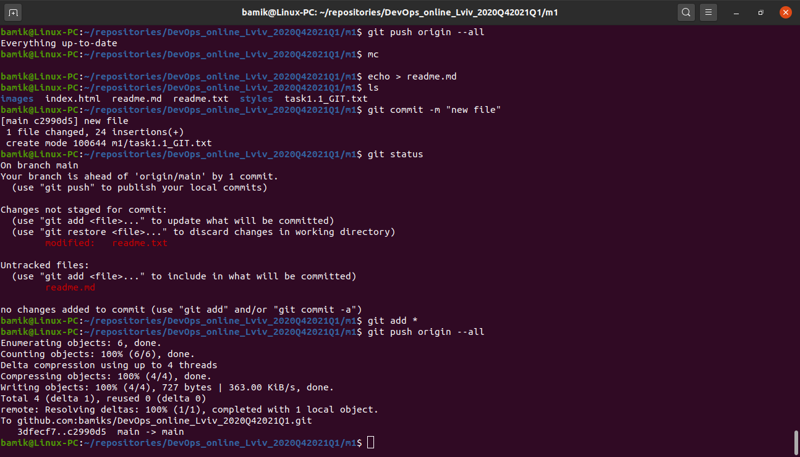

Step 1. Install and config GIT

Step 2. Create repo on Github and clone to local machine. Then work with Git commands -  branch, checkout, commit, merge, log(reflog).

Step 3 Push changes to repo GitHub

DevOps is an IT mindset that encourages communication, collaboration, integration, and automation among software developers and IT operations in order to improve the speed and quality of delivering software.
