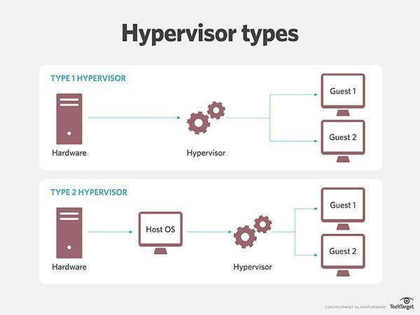
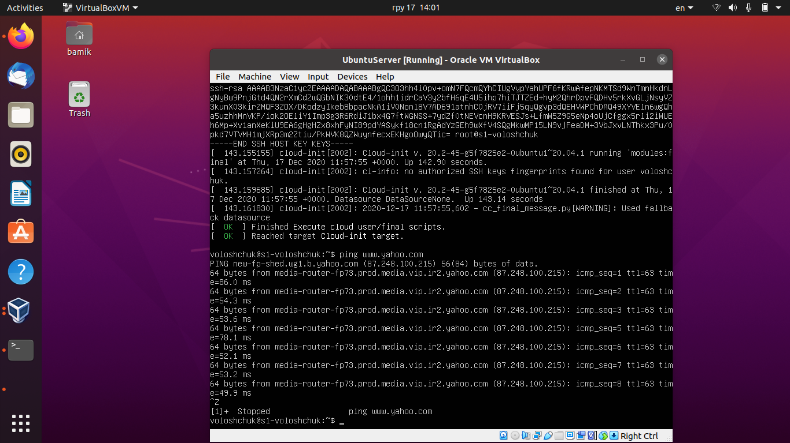
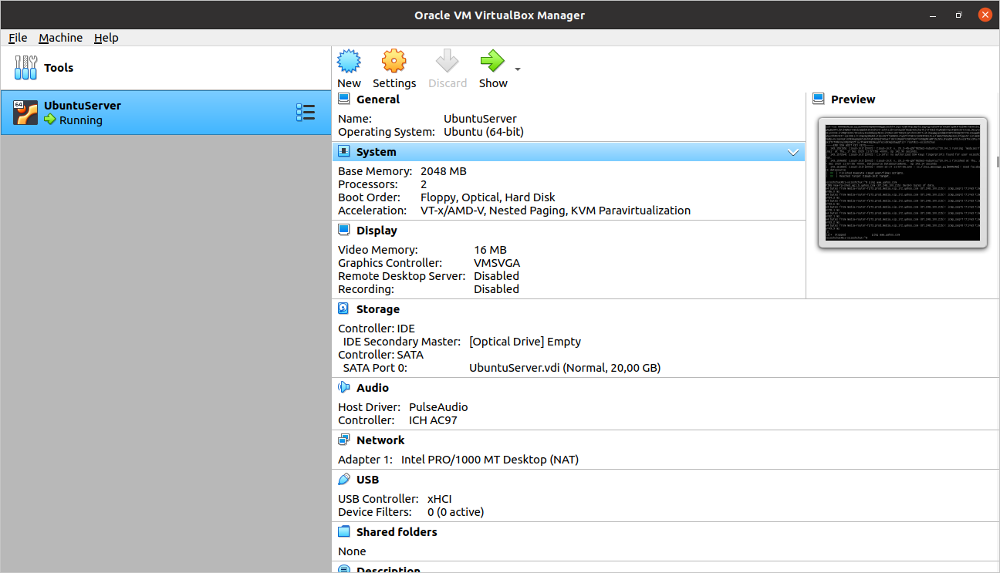
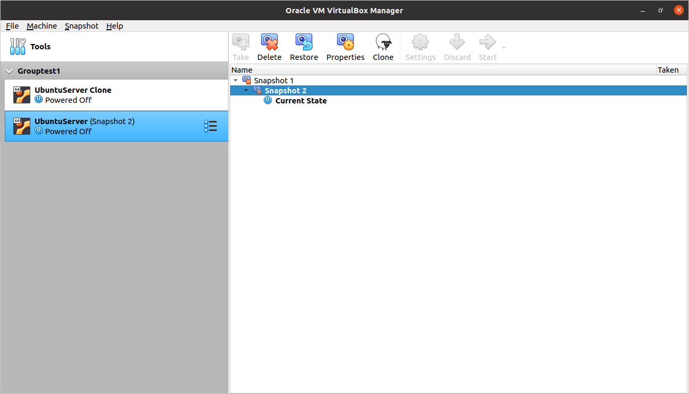
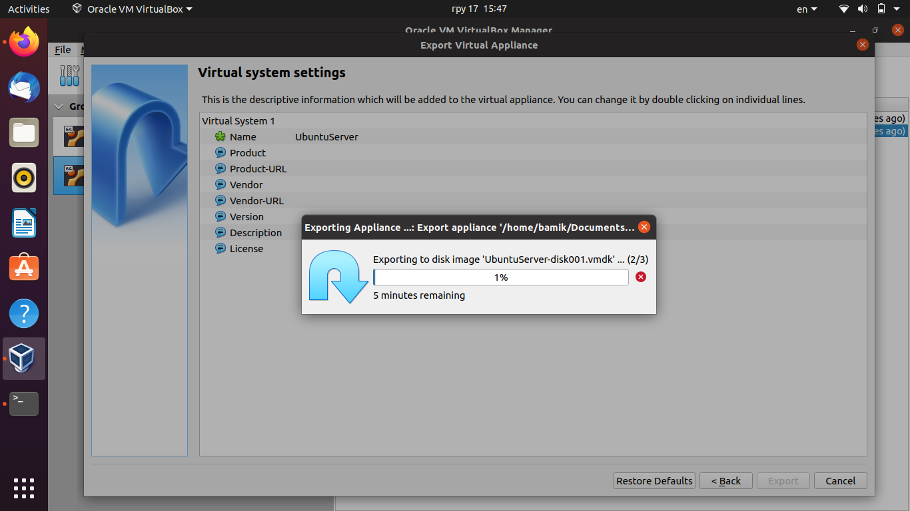
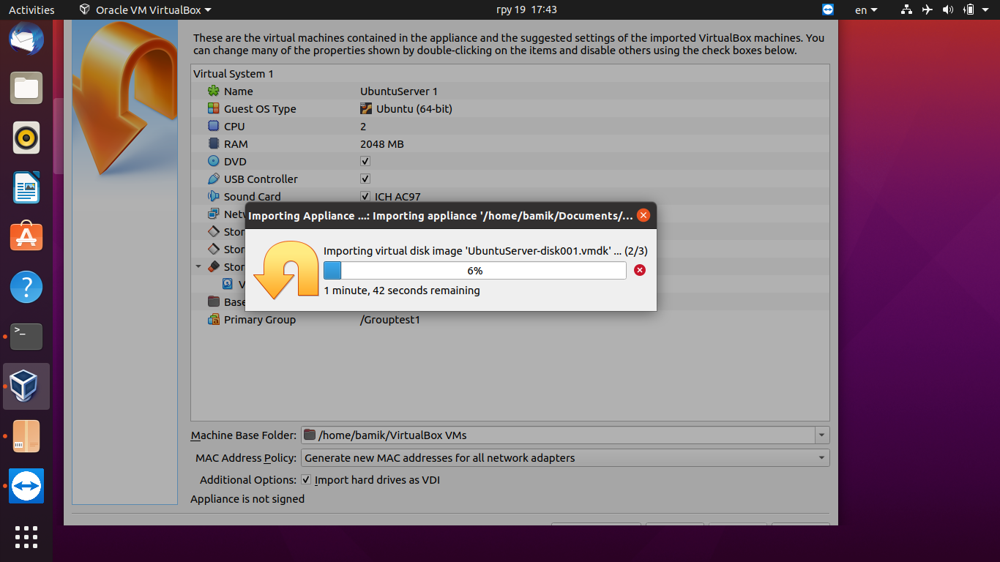
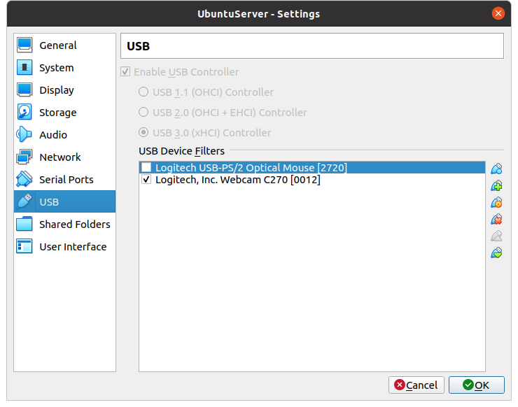
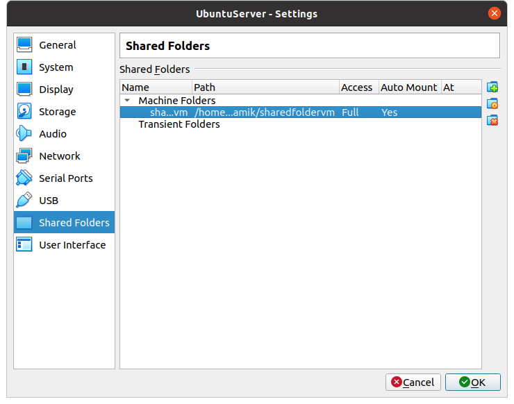

Q: What are the most popular hypervisors for infrastructure virtualization?

A: They are Oracle VM Virtual box, VMWare vSphere, MS Hyper-V

Q: Briefly describe the main differences of the most popular hypervisors

A: There are 2 types of hypervisors:

  Type 1: hypervisor runs directly on the host machine's physical hardware:
        VMware ESXi
	Microsoft Hyper-V
	open source KVM

    Type 2: hypervisor is typically installed on top of an existing OS:
        VMware Fusion
	Oracle VM VirtualBox
	Oracle VM Server for x86
	Oracle Solaris Zones
	Parallels
	VMware Workstation.

 Part 2. Work with Virtual box

I installed  Virtual box on Ubuntu Desktop (main host) and downloaded latest stable version  UbuntuServer (20.04). Then created VM1 and installed Ubuntu

Then cloned VM1, created a group of two VM and took snapshots, exported VM1

Imported VM from *.ova file

Configured USB and shared folder:

