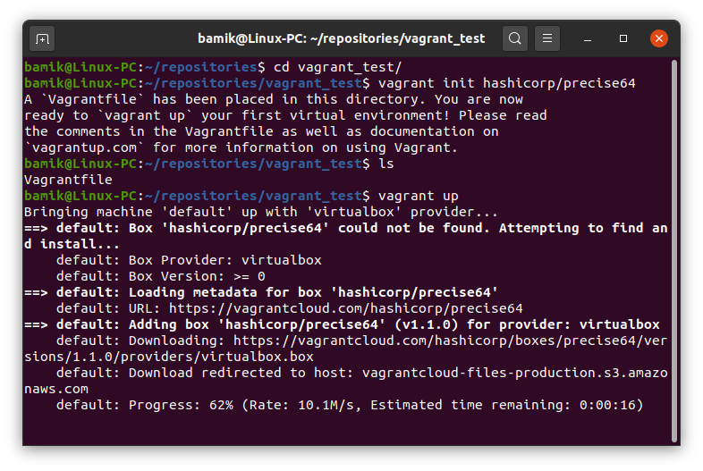

Q: What are the most popular hypervisors for infrastructure virtualization?

A: They are Oracle VM Virtual box, VMWare vSphere, MS Hyper-V

Q: Briefly describe the main differences of the most popular hypervisors

A: There are 2 types of hypervisors:

  Type 1: hypervisor runs directly on the host machine's physical hardware:
    
    VMware ESXi
	Microsoft Hyper-V
	open source KVM

  Type 2: hypervisor is typically installed on top of an existing OS:
    
    VMware Fusion
	Oracle VM VirtualBox
	Oracle VM Server for x86
	Oracle Solaris Zones
	Parallels
	VMware Workstation.

 Part 2. Work with Virtual box

I installed  Virtual box on Ubuntu Desktop (main host) and downloaded latest stable version  UbuntuServer (20.04). Then created VM1 and installed Ubuntu

Then cloned VM1, created a group of two VM and took snapshots, exported VM1

Imported VM from *.ova file

Configured USB and shared folder:

Then I configured the connections of different network modes (Bridge and NAT). Ping host<->VMs,VM1<->VM2, VMs to internet:

| Connection                | Ping |   |
|---------------------------|------|---|
| VM1 <\-> VM2 \(Bridged\)  | \+   |   |
| Host<\->VMs \(Bridged\)   | \+   |   |
| Host to VM\(NAT\)         | \-   |   |
| VMs\(NAT\) to internet    | \+   |   |
| VMs\(Bridge\) to internet | \+   |   |
| VMs\(Bridge\) to host     | \+   |   |
| VMs\(NAT\) to host        | \+   |   |

Then work with CLI through VBoxManage:

Part 3. Work with Vagrant

Vagrant init and vagrant up:

Connect to the VM using SSH:

Stop and delete the created VM:

Create own Vagrant box:

