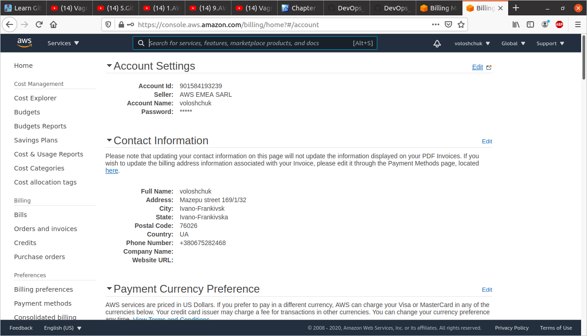
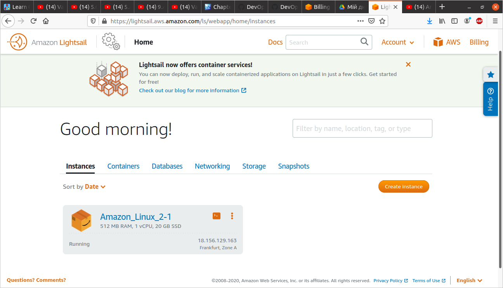
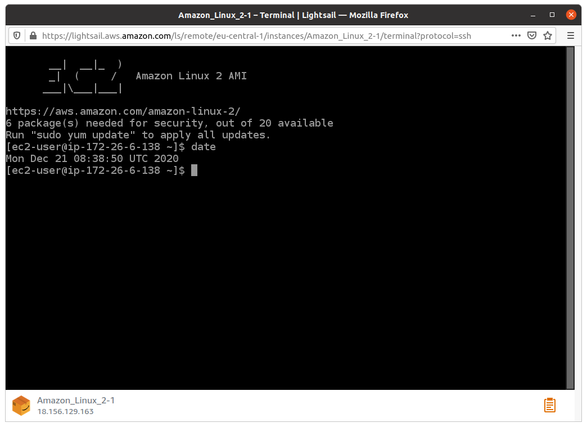

I registered with AWS

Then I created own Linux VM with Amazon Lightsail and connected to it.

Launched Linux VM with EC2 (t2 micro instance, CentOS):

Connected ssh:

Created a snapshot my instance as a backup:

Created EBS/Volume and attached Disk_D to my instance:

Mounted DiskD and created and saved some file on DiskD:

