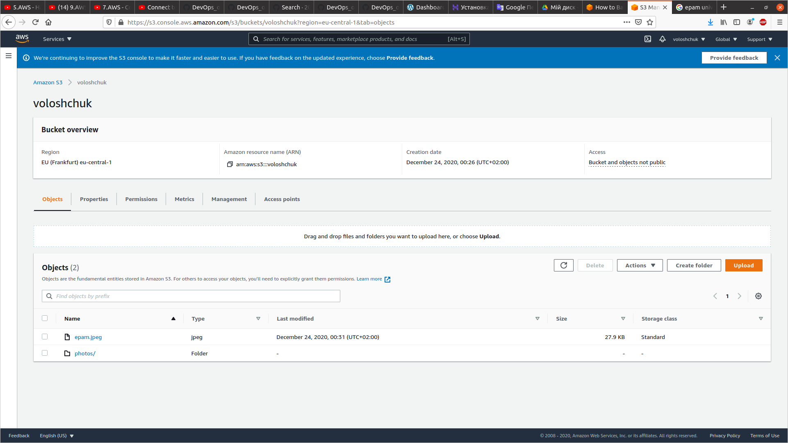

I registered with AWS

Then I created own Linux VM with Amazon Lightsail and connected to it.

Launched Linux VM with EC2 (t2 micro instance, CentOS):

Connected ssh:

Created a snapshot my instance:

Created EBS/Volume and attached Disk_D to my instance:

Mounted DiskD and created and saved some file on DiskD:

Then created from a snapshot AMIs and launched third instance from it

And dettached disk_D from the 2nd instance and attached Disk_D to the new instance:

Then launched and configured a Wordpress instance with Amazon Lightsail:

Then I created bucket in Amazon S3 and uploaded some files and folder. Then I deleted file:

Then I created IAM User, installed and configured AWS-CLI and uploaded/downloaded some files

I explored possibilities of creating my own domain and domain name
in Route 53 console (Route 53 is AWS’s DNS service).

Then I created a cluster (Amazon ESC) and ran the online demo aplication

Created a static website on Amazon S3:

http://websitevoloshchuk.s3-website.eu-central-1.amazonaws.com
