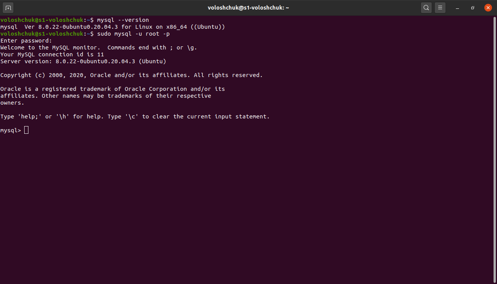
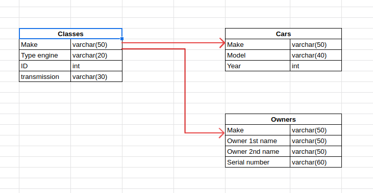
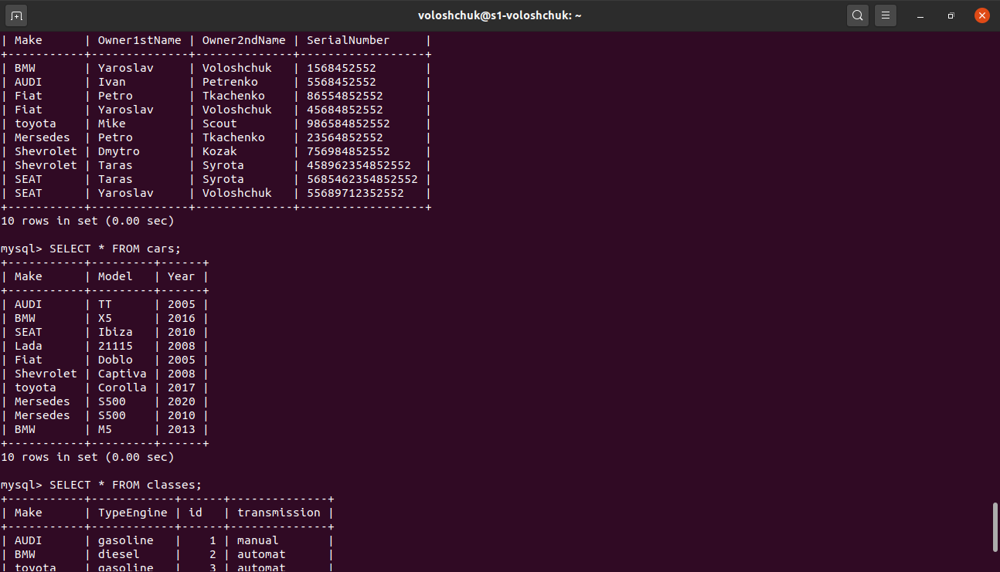
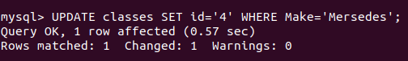
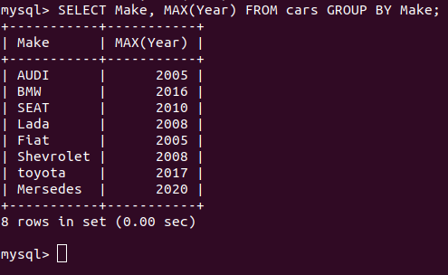
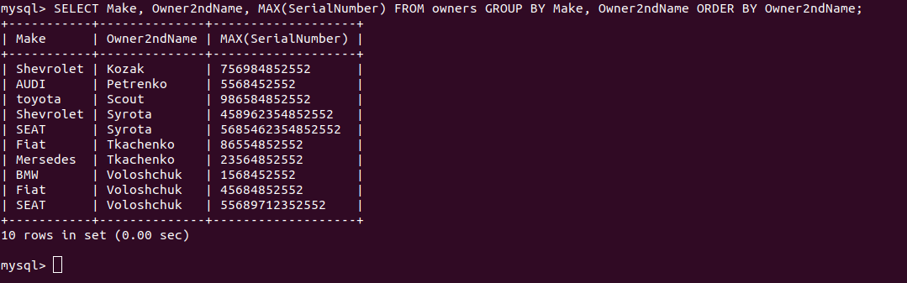
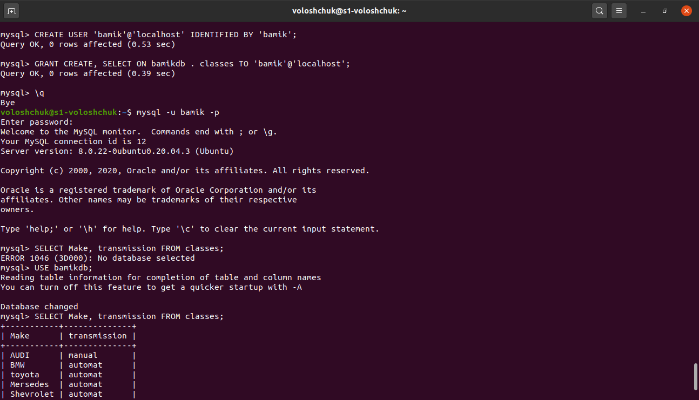
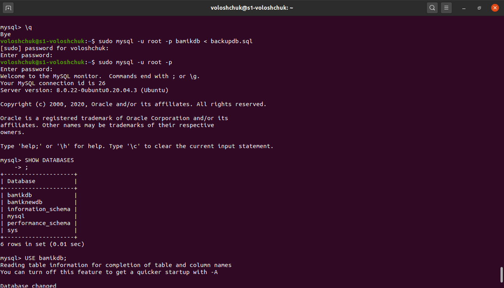
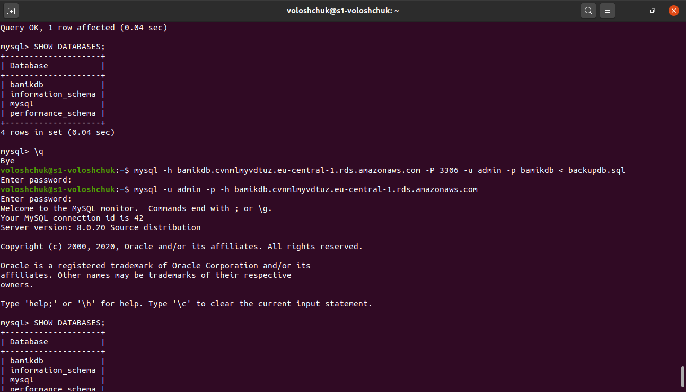

TASK 3.1 Database Administration

Step 1. Connected to VM for ssh. Downloaded MySQL server for Ubuntu on VM. Installed MySQL server on VM and ran mysql:

Step 2. Database schema (3 tables):

Step 3. Created database (bamikdb), created tables (classes, cars and owners)  and filled in tables (INSERT INTO tables):

Step 4.Some queries:

Step 5. Created a new user with different privileges and connected to db. Made a selection from db.

Step 6. Made backup my database, deleted table and restored:

voloshchuk@s1-voloshchuk:~$ sudo mysqldump -u root -p bamikdb > backupdb.sql

mysql> DROP TABLE cars;
Query OK, 0 rows affected (2.26 sec)

voloshchuk@s1-voloshchuk:~$ sudo mysql -u root -p bamikdb < backupdb.sql

 

Step 7. Transfered my local DB to RDS AWS:

mysql -h bamikdb.cvnmlmyvdtuz.eu-central-1.rds.amazonaws.com -P 3306 -u admin -p bamikdb < backupdb.sql

