TASK 4.1

Network (4 pc with HUB-PT):

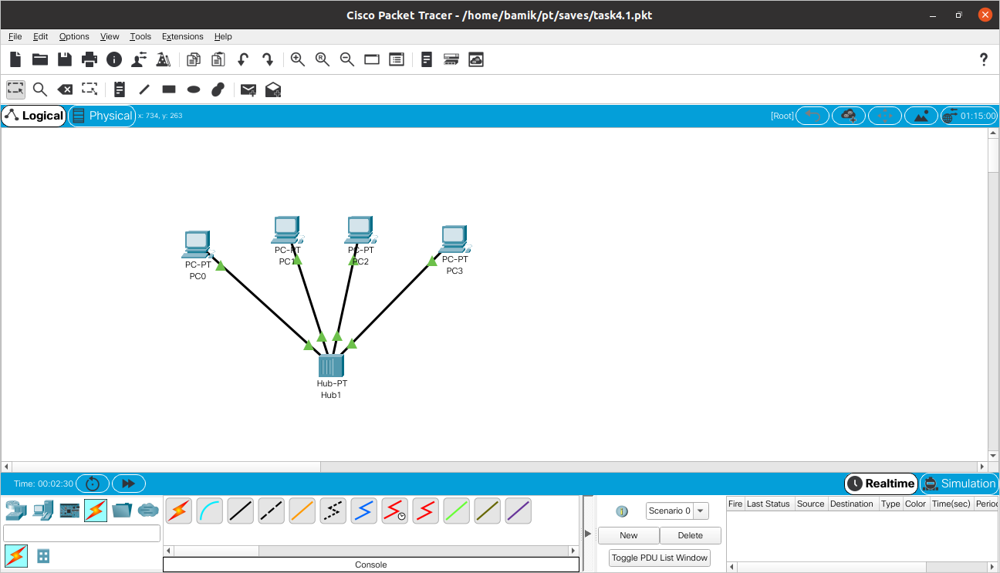

Simulation mode (ISMP):
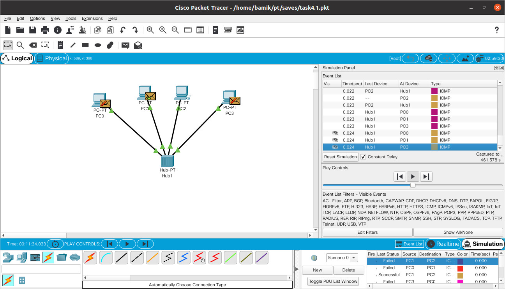

Simulation panel (OSI Model):

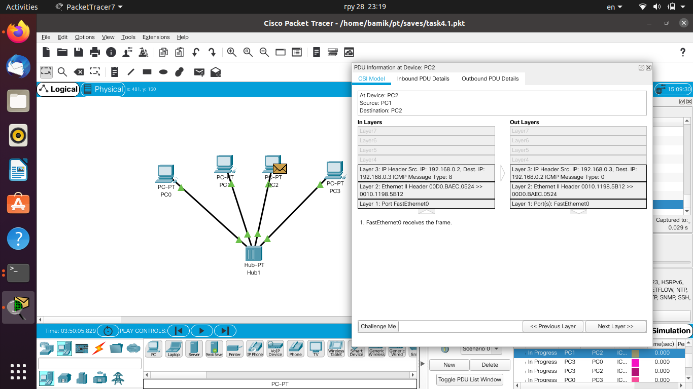

Network (6pc with two HUB-PT and Server-PT):

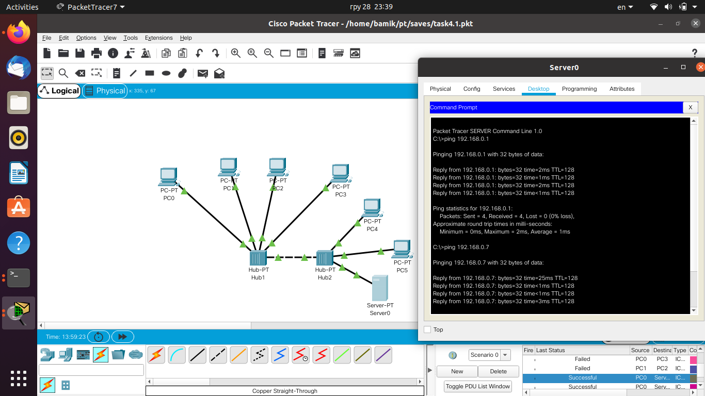

Then I created new network ( 4 pc and switch):

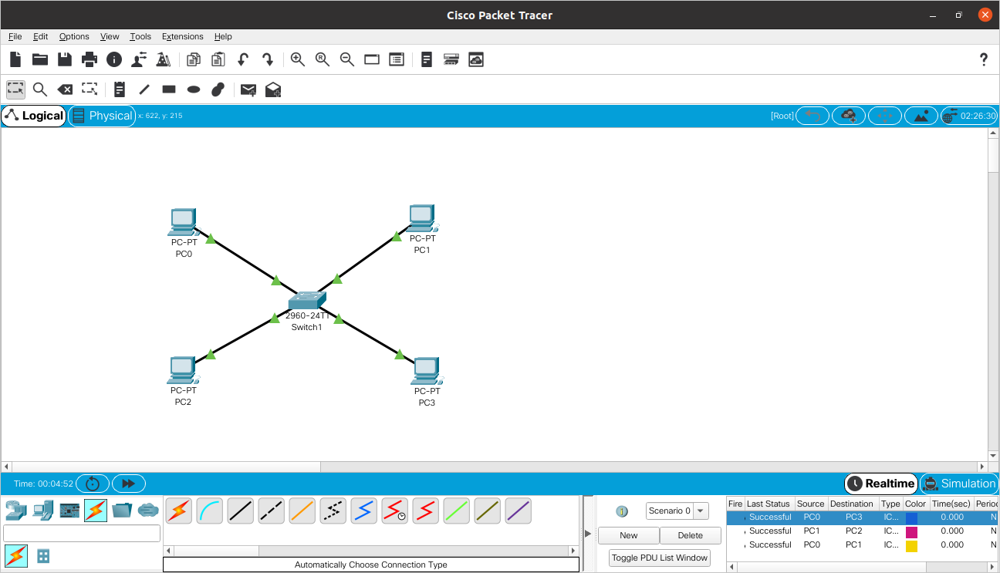

And also tested the network:

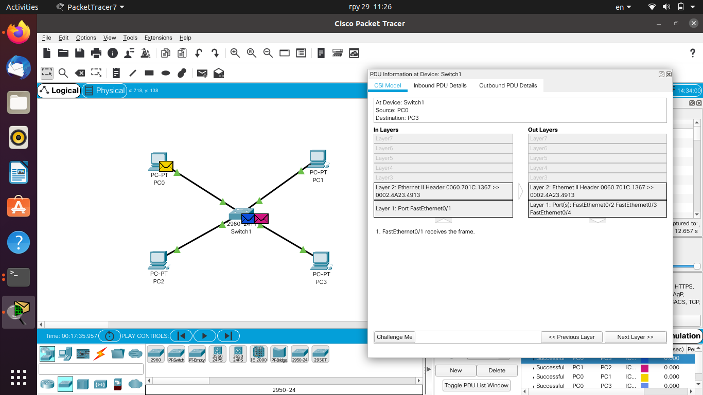

Then I extended the project to the next topology ( 2 Switch, 8 PC):

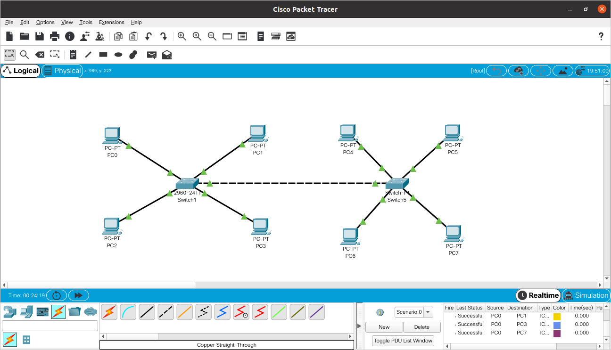

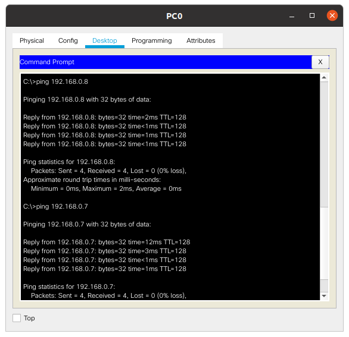

Then divided the network into two subnets using a router:

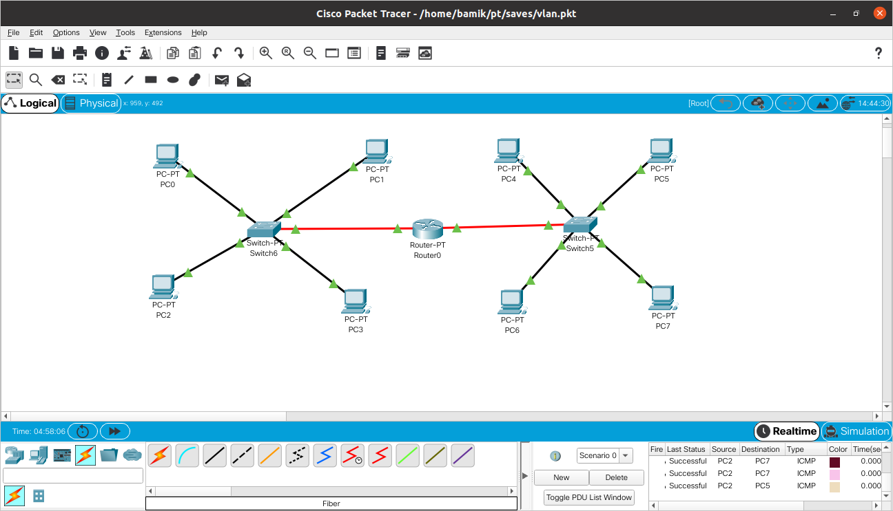

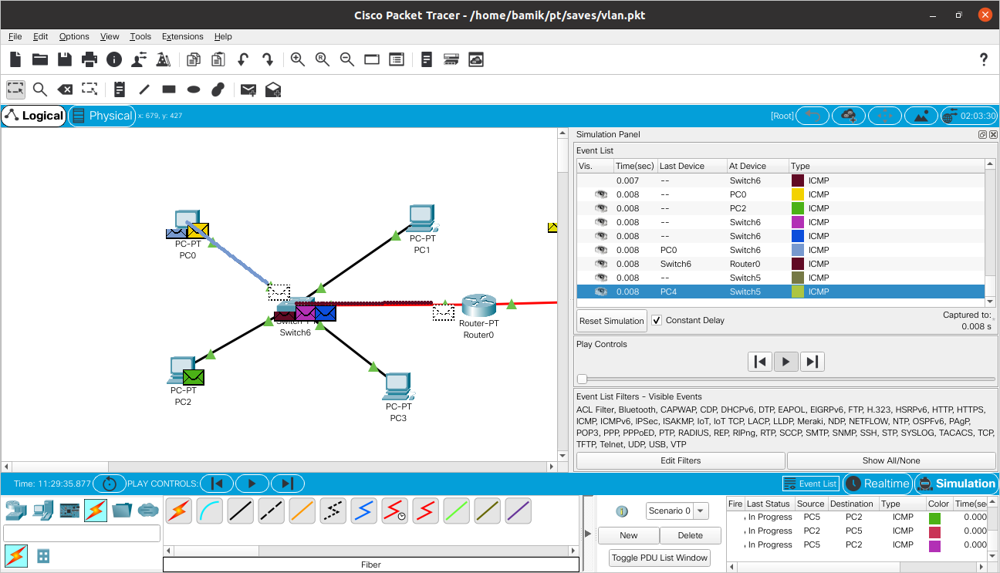

1st subnetwork:
PC0 - 192.168.0.1
PC1 - 192.168.0.2
PC2 - 192.168.0.3
PC3 - 192.168.0.4
Gateway - 192.168.0.10

2nd subnetwork:
PC4 - 192.168.1.1
PC5 - 192.168.1.2
PC6 - 192.168.1.3
PC7 - 192.168.1.4
Gateway - 192.168.1.10

Ping from first subnetwork to second subnetwork (PC0 192.168.0.1 -> PC7 192.168.1.4):

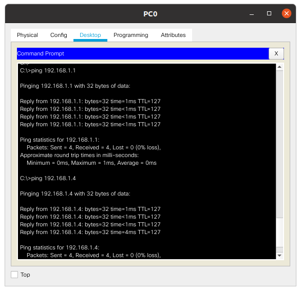

Ping from  second subnetwork to first subnetwork (PC5 192.168.1.2 -> PC2 192.168.0.3):

So, after analyzing different network topologies, we learned that a router is an electronic device used to connect two or more networks and controls the routing process, which based on information about the network topology and certain rules decides to send packets at the network layer (level 3 model OSI) between different network segments. Routers work at the network level of the OSI model: they can send packets from one network to another. In order to send packets in the desired direction, the router uses a routing table, which is stored in its memory. The routing table can be composed by means of static or dynamic routing.
