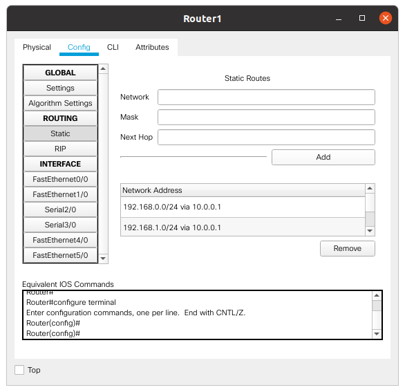

TASK 4.2

4.2.1 Topology of the corporate network, which includes two buildings with 2 floors in each. The horizontal subsystem of the floor has one group of 5 computers

First building, first floor:

PC0 192.168.0.1
PC1 192.168.0.2
PC2 192.168.0.3
PC3 192.168.0.4
PC4 192.168.0.5
Gateway 192.168.0.10

First building, second floor:

PC5 192.168.1.1
PC6 192.168.1.2
PC7 192.168.1.3
PC8 192.168.1.4
PC9 192.168.1.5
Gateway 192.168.1.10

Second building, first floor:

PC10 192.168.2.1
PC11 192.168.2.2
PC12 192.168.2.3
PC13 192.168.2.4
PC14 192.168.2.5
Gateway 192.168.2.10

Second building, second floor:

PC15 192.168.3.1
PC16 192.168.3.2
PC17 192.168.3.3
PC18 192.168.3.4
PC19 192.168.3.5
Gateway 192.168.3.10

Static routes on Router0 and Router1:

Ping between two buildings:

The network is working.

TASK 4.2.2

Corporate network, which contains 1 house with four floors. The horizontal subsystem of the floor consists of two working groups of 3 and 5 computers, respectively. I made a logical structuring of the network into 8 subnets (according to the number of working groups).

Router configure (CLI):

Router>show ip rip database
192.168.0.0/24    auto-summary
192.168.0.0/24    directly connected, FastEthernet1/0
192.168.1.0/24    auto-summary
192.168.1.0/24    directly connected, FastEthernet0/0
192.168.2.0/24    auto-summary
192.168.2.0/24    directly connected, FastEthernet2/0
192.168.3.0/24    auto-summary
192.168.3.0/24    directly connected, FastEthernet3/0
192.168.4.0/24    auto-summary
192.168.4.0/24    directly connected, FastEthernet4/0
192.168.5.0/24    auto-summary
192.168.5.0/24    directly connected, FastEthernet5/0
192.168.6.0/24    auto-summary
192.168.6.0/24    directly connected, FastEthernet7/0
192.168.7.0/24    auto-summary
192.168.7.0/24    directly connected, FastEthernet6/0
Router>

Router>show interfaces
FastEthernet0/0 is up, line protocol is up (connected)
  Hardware is Lance, address is 0030.f2c0.4d37 (bia 0030.f2c0.4d37)
  Internet address is 192.168.1.10/24

FastEthernet1/0 is up, line protocol is up (connected)
  Hardware is Lance, address is 0001.9762.2751 (bia 0001.9762.2751)
  Internet address is 192.168.0.10/24

FastEthernet2/0 is up, line protocol is up (connected)
  Hardware is Lance, address is 0004.9a39.3b2c (bia 0004.9a39.3b2c)
  Internet address is 192.168.2.10/24

FastEthernet3/0 is up, line protocol is up (connected)
  Hardware is Lance, address is 00d0.bc72.4b0c (bia 00d0.bc72.4b0c)
  Internet address is 192.168.3.10/24

FastEthernet4/0 is up, line protocol is up (connected)
  Hardware is Lance, address is 0006.2ad1.cba6 (bia 0006.2ad1.cba6)
  Internet address is 192.168.4.10/24

FastEthernet5/0 is up, line protocol is up (connected)
  Hardware is Lance, address is 00d0.ff73.2780 (bia 00d0.ff73.2780)
  Internet address is 192.168.5.10/24

FastEthernet6/0 is up, line protocol is up (connected)
  Hardware is Lance, address is 0060.47bd.72ae (bia 0060.47bd.72ae)
  Internet address is 192.168.7.10/24

FastEthernet7/0 is up, line protocol is up (connected)
  Hardware is Lance, address is 0001.c99c.7356 (bia 0001.c99c.7356)
  Internet address is 192.168.6.10/24

Also, each PC in its subnet was assigned its own IP. Check if the network is working:

Some ping:

From PC24 (192.168.6.1) - fourth floor to PC12 (192.168.3.2) and PC10 (192.168.2.3)- second floor:

From PC2 (192.168.1.3) - first floor to PC31 (192.168.7.4) - fourth floor and PC21(192.168.5.1) -third floor:

The network is working.
