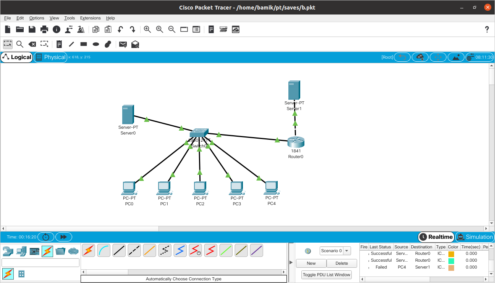
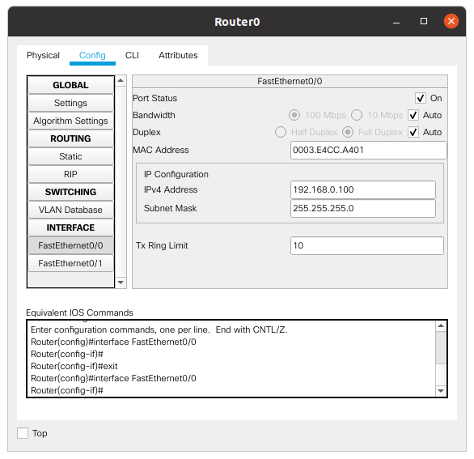
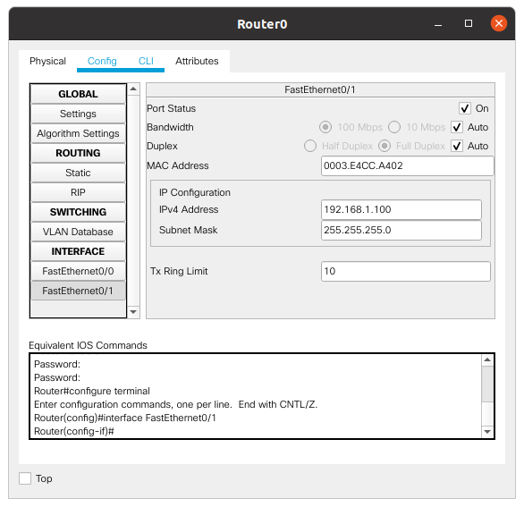
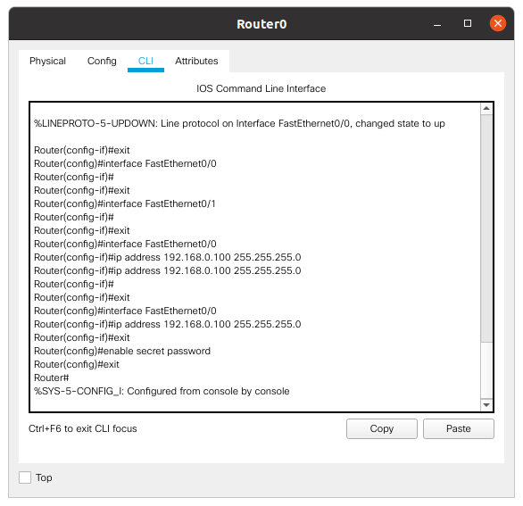
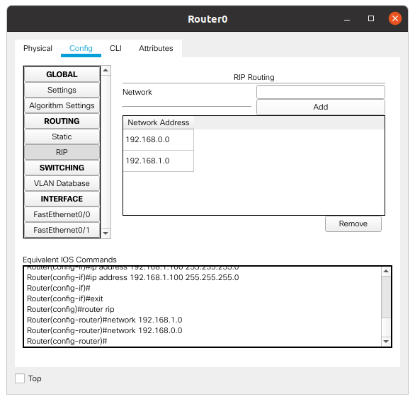
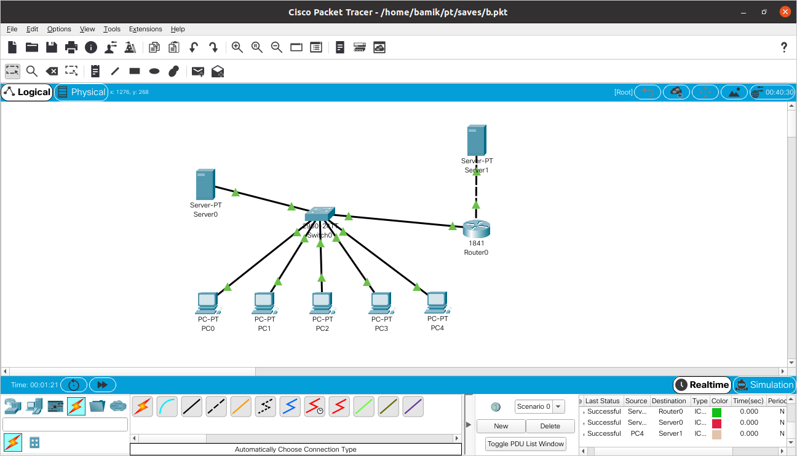
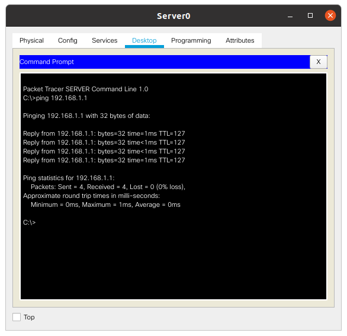
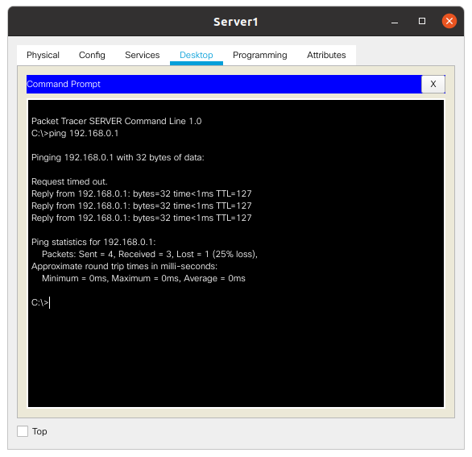

Task 4.3

Build a local network (one switch, 5 pc and server). Switch is connected to the router and the server is  connected to the router:

 

Then assign ip addresses to computers and server:

PC0 - 192.168.0.1
PC1 - 192.168.0.2
PC2 - 192.168.0.2
PC3 - 192.168.0.3
PC4 - 192.168.0.4
PC5 - 192.168.0.5
Server0 - 192.168.0.6
Server1 - 192.168.1.1

Then configured the router(CLI):

Then configured RIP on the router:

Then test the network:

Ping from Server0 to Server1:

Ping from Server1 to PC0:

The transfer of data according to the ICMP protocol between all objects of the network is achieved
