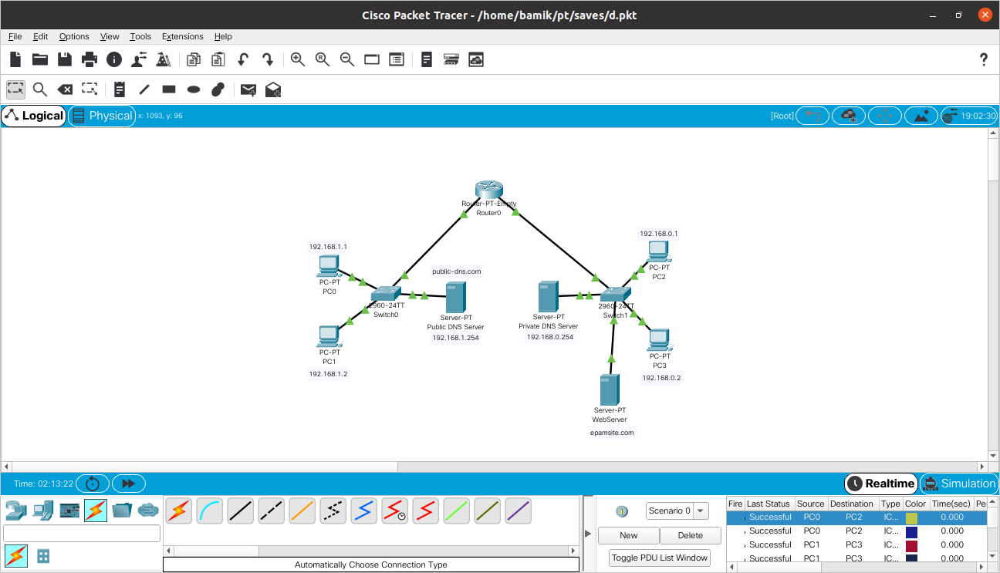
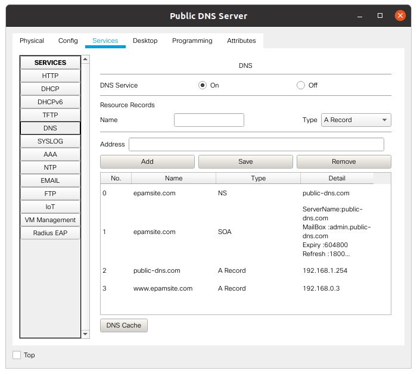
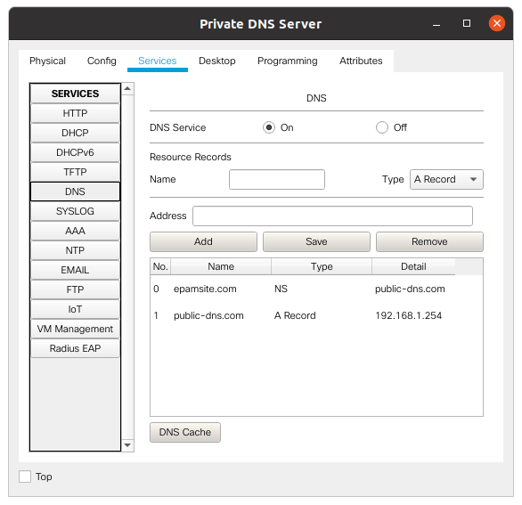
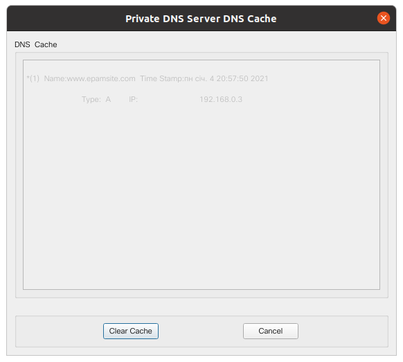
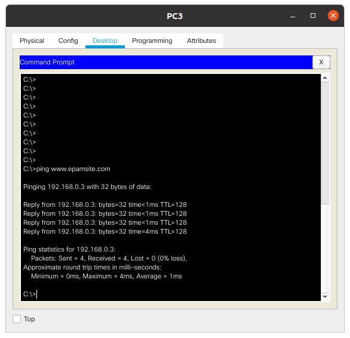
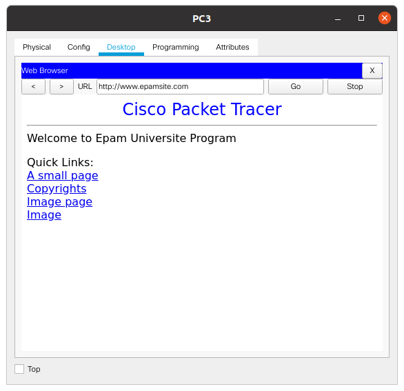

TASK 4.4

4.4.1. Сonfigured  traffic between two network with two routers:

I have done it during working on task 4.2.1. Please take a look next link:

https://github.com/YaroslavVoloshchuk/DevOps_online_Lviv_2020Q42021Q1/blob/main/m4/task4.2/readme.md

4.4.2. We have two subnets. We will configure DNS on servers: 

Configured Public DNS Server:

Configured Private DNS Server:

Ping:

