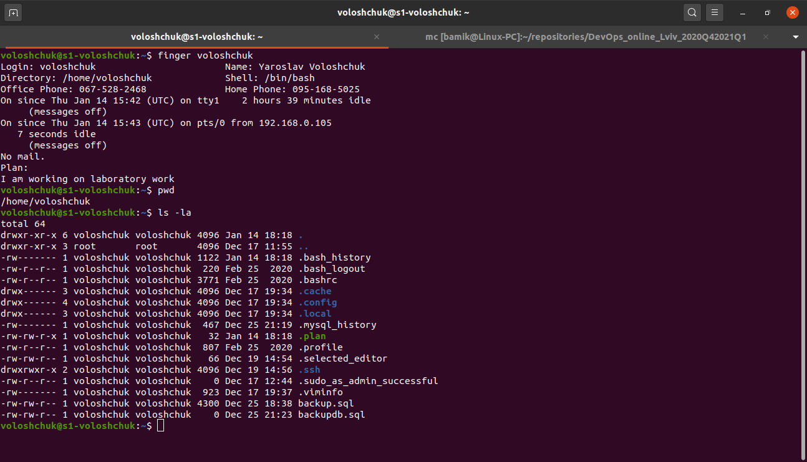
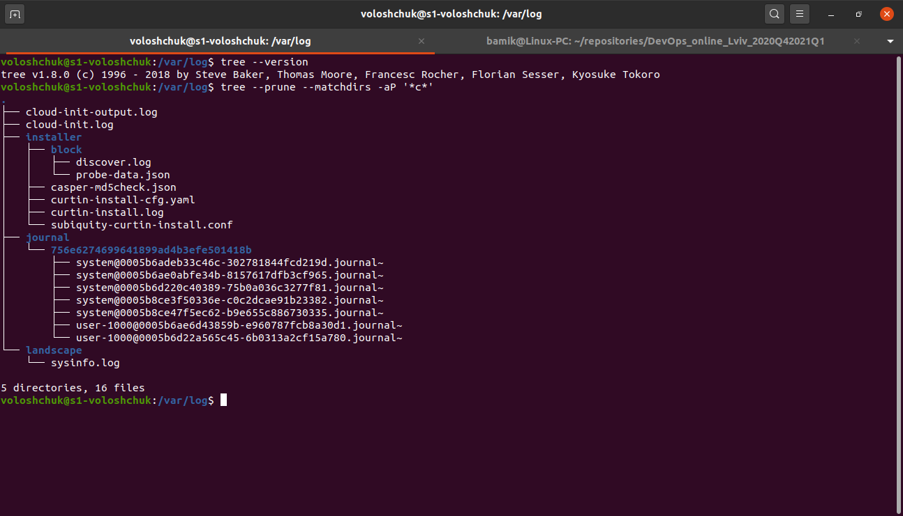

TASK 5.1 Part 1.

Connected via ssh to UbuntuServer (VM on VirtualBox) from Ubuntu Desktop (main host) and login to the system as root:

Executed the command `info passwd` and examined the basic parameters of the command and changed the password. System file /etc/shadow has changed.

Users registered in the system:

`cat /etc/passwd`

Display only the username: `cut -d: -f1 /etc/passwd`

The /etc/passwd file is a colon-separated file that contains the following information:

    User name.
    Encrypted password.
    User ID number (UID)
    User's group ID number (GID)
    Full name of the user (GECOS)
    User home directory.
    Login shell.

List Connected Users (command `w` or `who`):
 

Changed personal information (`chfn`):

Then I read the Linux help system (command `man man` and `man info`) Example: `man passwd`

Example of a command with two keys: `passwd -S -a`

Then I read about `more` and `less` commands using the help system. Search .bash* files in the home directory (`ls -la`) View the content of files .bash:

`less .bashrc`

Then I installed Finger - command is a user information lookup command which gives details of all the users logged in. (`sudo apt install finger`) and read the documentation for the finger command and created file `.plan`.  Example: `finger voloshchuk`

And list the contents of the home directory using the ls command (`ls -la`)

TASK5.1 Part 2

Installed tree (`sudo apt install tree`)

Then display all files that contain a character `c` in the directory /var/log

`tree -P '*c*'`

Display all files that contain a character `traceroute` in `/` – The Root Directory.

`tree --prune -P '*traceroute*'`

