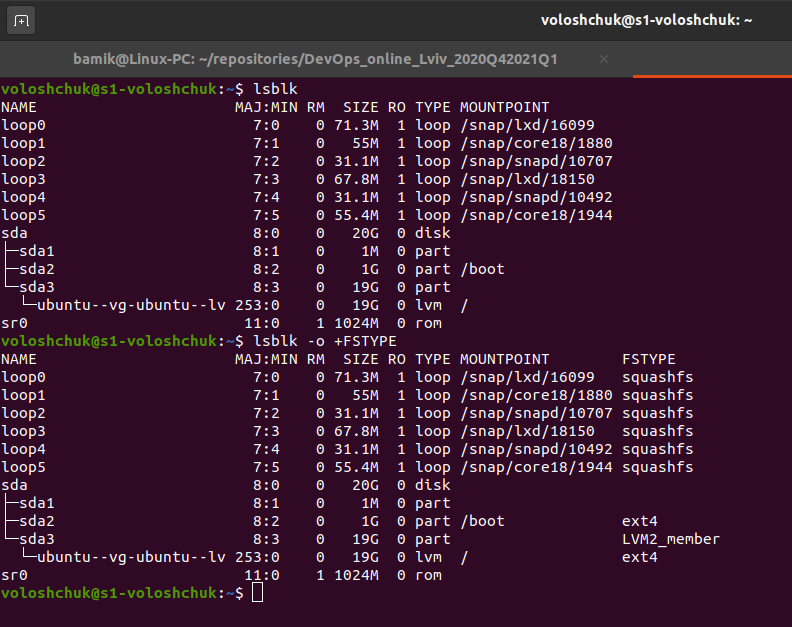

TASK 5.1 Part 1.

1. Connected via ssh to UbuntuServer (VM on VirtualBox) from Ubuntu Desktop (main host) and login to the system as root:

2. Executed the command `info passwd` and examined the basic parameters of the command and changed the password. System file /etc/shadow has changed.

3. Users registered in the system:

`cat /etc/passwd`

Display only the username: `cut -d: -f1 /etc/passwd`

The /etc/passwd file is a colon-separated file that contains the following information:

    User name.
    Encrypted password.
    User ID number (UID)
    User's group ID number (GID)
    Full name of the user (GECOS)
    User home directory.
    Login shell.

List Connected Users (command `w` or `who`):
 

4. Changed personal information (`chfn`):

5. Then I read the Linux help system (command `man man` and `man info`) Example: `man passwd`

Example of a command with two keys: `passwd -S -a`

6. Then I read about `more` and `less` commands using the help system. Search .bash* files in the home directory (`ls -la`) View the content of files .bash:

`less .bashrc`

7. Then I installed Finger - command is a user information lookup command which gives details of all the users logged in. (`sudo apt install finger`) and read the documentation for the finger command and created file `.plan`.  Example: `finger voloshchuk`

8. And list the contents of the home directory using the ls command (`ls -la`)

TASK5.1 Part 2

1. Installed tree (`sudo apt install tree`)

Then display all files that contain a character `c` in the directory /var/log

`tree --prune --matchdirs -aP '*c*'`

Display all files that contain  `traceroute` in `/` – The Root Directory.

`tree --prune --matchdirs -aP '*traceroute*'`

2. To determine the file type of a file passed the name of a file to the `file` command. The file name along with the file type will be printed to standard output.

`file *` in the directory /var/log:

3. An absolute path is defined as the specifying the location of a file or directory from the root directory(/). In other words we can say absolute path is a complete path from start of actual filesystem from / directory.
Some examples of absolute path:

`/var/log/kernel`

`/boot/grub/grub.cfg`

Relative path is defined as path related to the present working directory(pwd). Suppose I am located in /home/voloshchuk and I want to change directory to /home/voloshchuk/labs. I can use relative path concept to change directory to labs.

`$ pwd`

`/home/voloshchuk`

`$cd labs/`

`$pwd`

`/home/voloshchuk/labs`

Navigate to the home directory from anywhere in the filesystem is to use command `cd` with the tilde (~) character, as shown below:

`cd ~`

4. I got acquainted with various parameters of the `ls` command

`ls -l` - list files in long format. Here, `ls -l` shows file or directory, size, modified date and time, file or folder name and owner of file and its permission.

`ls -la` - list files in long format including hidden files

5. Performed the following sequence of operations:

Created a subdirectory in the home directory

`mkdir labs`

Create a file containing information about directories
located in the root directory (using I/O redirection operations)

`ls -la / > inforootdir`

View the created file:

`cat inforootdir`

Copy the created file to your home directory using relative and absolute addressing:

`cp inforootdir /home/voloshchuk/inforootdir` - absolute addressing;

`cp inforootdir ~/inforootdir` - relative addressing.

Deleted the previously created subdirectory with the file: 

`rm -r labs`

Delete the file copied to the home directory:

`rm inforootdir`

6. Created subdirectory `test` in the home directory:

`mkdir test`

Copied the `.bash_history` file to `test` directory while changing its name to `labwork2`

`cp .bash_history ~/test/labwork2`

Created a hard and soft link to the `labwork2` file in `test` directory:

`ln labwork2 hardlink`

`ln -s labwork2 softlink`

A symbolic or soft link is an actual link to the original file, whereas a hard link is a mirror copy of the original file. If you delete the original file, the soft link has no value, because it points to a non-existent file. But in the case of hard link, it is entirely opposite. Even if you delete the original file, the hard link will still has the data of the original file. Because hard link acts as a mirror copy of the original file.

Changed the data a symbolic link:

`echo "another line" >> softlink`

As a result of changes to the symlink, the size of the original file and the hardlink changed, but the size of the symlink did not change. Because a symlink is an actual link to the original file.

Rename the hard link file to hard_lnk_labwork2:

`mv hardlink hard_lnk_labwork2`

Rename the soft link file to symb_lnk_labwork2:

`mv softlink symb_lnk_labwork2`

Then deleted the `labwork2` file:

`rm labwork2`

As a result of deleting the original file, the symlink wasn't working, because it is actually a link to the file.

`cat: symb_lnk_labwork2: No such file or directory`

But hard_lnk_labwork2 works because the hard link is a copy of the original file.

7. Using the locate utility, finded all files that contain the `squid` and `traceroute` sequence:

`sudo apt install mlocate`

`sudo updatedb`

`locate  "*squid*" "*traceroute*"`

`locate -c "*squid*" "*traceroute*"`

8. Determined which partitions are mounted in the system, as well as the types of these partitions:

`lsblk`

`lsblk -o +FSTYPE`

 
9. Counted the number of lines containing a given sequence of characters in a given file:

`grep 'ls' hard_lnk_labwork2 | wc -l`

10. Using the `find` command, finded all files in the `/etc` directory containing the `host` character sequence.

`find /etc -iname "*host*"`

11. Listed all objects in `/etc` that contain the `ss` character sequence and duplicated a similar command using a bunch of grep:

`ls -la /etc | grepp ss`

12. Organized a screen-by-screen print of the contents of the /etc directory:

`ls -la /etc | less > dev/pts/0`

 

13. Determine the type of device, what are the types of devices:

In Linux various special files can be found under the directory /dev. These files are called device files and behave unlike ordinary files. The most common types of device files are for block devices and character devices. These files are an interface to the actual driver (part of the Linux kernel) which in turn accesses the hardware. Another, less common, type of device file is the named pipe. 

`ls -l /dev`

The columns are as follows from left to right:

    Permissions
    Owner
    Group
    Major Device Number
    Minor Device Number
    Timestamp
    Device Name

Remember in the ls command you can see the type of file with the first bit on each line. Device files are denoted as the following:

    c - character
    b - block
    p - pipe
    s - socket

`lspci` - list all PCI devices 

14. Determined the type of file in the system, what types of files are there.

`ls -l`

`ls` command will show the file type as an encoded symbol found as the first character of the file permission part. In this case it is `"-"`, which means "regular file". It is important to point out that Linux file types are not to be mistaken with file extensions. Let us have a look at a short summary of all the seven different types of Linux file types and ls command identifiers:

   `-` - regular file;
   `d` - directory;
   `c` - character device file;
   `b` - block device file;
   `s` - local socket file;
   `p` - named pipe;
   `l` - symbolic link.

15. Listed the first 5 directory files that were recently accessed in the `/etc` directory:

`ls -l /etc | head -n6`

Hooray. Task 5.1 done.
