TASK 5.2

1. Analyze the structure of the /etc/passwd and /etc/group file, what fields are present in it, what users exist on the system? Specify several pseudo-users, how to define them.

Linux stores most account features in the /etc/passwd file. It is a text-based file with with seven fields for each entry. Each entry begins with a username and continues with a set of fields separated by colons (:). Here is the syntax of an entry in the /etc/passwd file:

username:password:UID:GID:comment:home directory:default shell

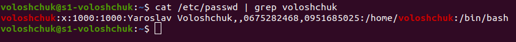

In the picture above we can see the following information:

    username – voloshchuk 
    password – stored in the /etc/shadow file
    UID – 1000
    GID – 1000
    comment – full name of the user is Yaroslav Voloshchuk, phone numbers
    home directory – /home/voloshchuk
    default shell – /bin/bash

The group membership in Linux is controlled through the /etc/group file. This is a simple text file that contains a list of groups and the members belonging to each group. Just like the /etc/passwd file, the /etc/group file consists of a series of colon-delimited lines, each of which defines a single group. The file is readable by all users.

Here is how an entry in the /etc/group file looks like:

group name:password:GID:list of users

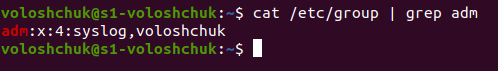

In the example above you can see that the group `adm` has a GID of 4 and two users: syslog and voloshchuk.
 
Linux distributions contains pseudo-user description lines in the `passwd` file. These descriptions are never edited. Users of these names are not registered in the system and are only needed to confirm owner ship of the processes.

The most used are: daemon (used by system service processes), bin (gives ownership of executables command), adm (own sregistration files), nobody (used by many services), sshd (used by the secure shell server).

2. What are the uid ranges? What is UID? How to define it?

A UID (user identifier) is a number assigned by Linux to each user on the system. This number is used to identify the user to the system and to determine which system resources the user can access. UIDs are stored in the `/etc/passwd` file:

`cat /etc/passwd`

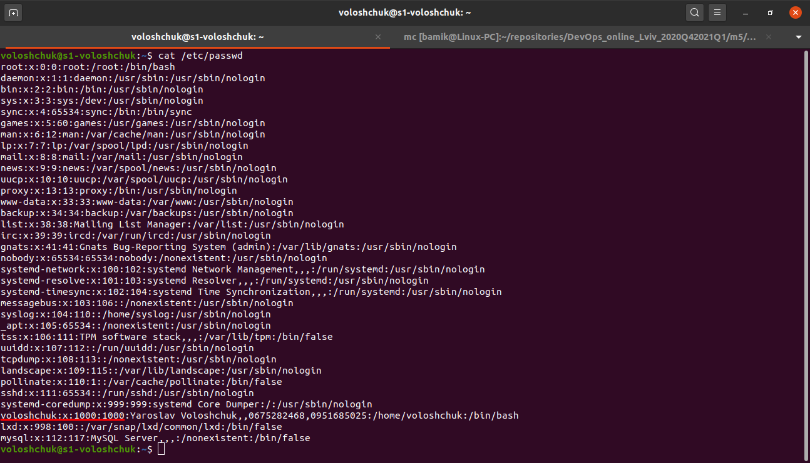

The third field represents the UID. Notice how the root user has the UID of 0. Most Linux distributions reserve the first 100 UIDs for system use. New users are assigned UIDs starting from 500 or 1000. For example, new users in Ubuntu start from 1000.

When you create a new account, it will usually be give the next-highest unused number. If we create a new user on our Ubuntu system, it will be given the UID of 1001.

3. What is GID? How to define it?

Groups in Linux are defined by GIDs (group IDs). Just like with UIDs, the first 100 GIDs are usually reserved for system use. The GID of 0 corresponds to the root group and the GID of 100 usually represents the users group. GIDs are stored in the `/etc/group` file:

`cat /etc/group`

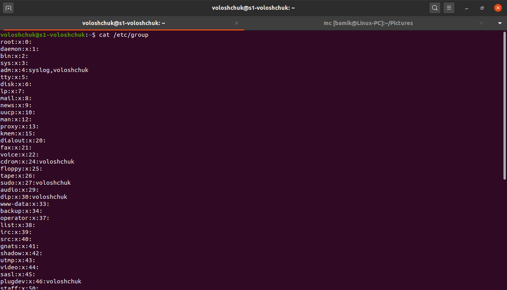

The third field represents the GID. New groups are usually assigned GIDs starting from 1000.

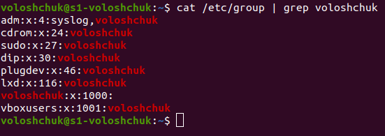

4. How to determine belonging of user to the specific group?

`id username` or `cat /etc/group | grep username`

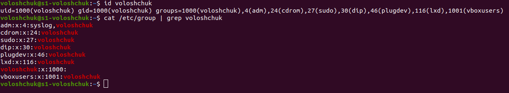

5. What are the commands for adding a user to the system? What are the basic parameters required to create a user?

To add/create a new user, all you've to follow the command `useradd` or `adduser` with 'username'. 

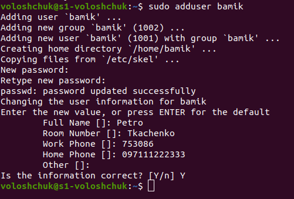

`useradd` is a low-level utility for adding users to a system.

When we run `useradd` command in Linux terminal, it performs following major things:

    It edits /etc/passwd, /etc/shadow, /etc/group and /etc/gshadow files for the newly created User account.
    Creates and populate a home directory for the new user.
    Sets permissions and ownerships to home directory.

Basic parameters required to create a user:

6. How do I change the name (account name) of an existing user?

`usermod -l login-name old-name`

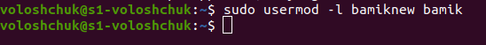

7. What is skell_dir? What is its structure?

Skel is derived from the skeleton because it contains basic structure of home directory.

The /etc/skel directory contains files and directories that are automatically copied over to a new user’s when it is created from useradd command.

This will ensure that all the users gets same intial settings and environment.

`ls -la /etc/skel/`

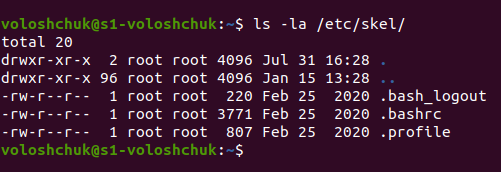

8. How to remove a user from the system (including his mailbox)?

To delete a user via the command line:

`# userdel username`

To remove the user's home directory and mail spool:

`# userdel -r username`

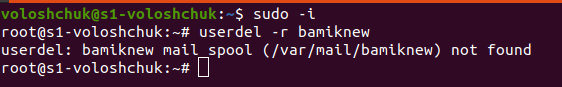

9. What commands and keys should be used to lock and unlock a user account?

Verify the status of a user with `passwd` command

`passwd -S user_name`

Look at the second field in the output. Here’s what it means:

– P or PS: password is set (user is unlocked)
– L or LK: User is locked
– N or NP: No password is needed by the user

To lock a user use the option -l or –lock in this manner:

`passwd -l user_name`

To unlock the  use the option -u or –unlock:

`passwd -u user_name`

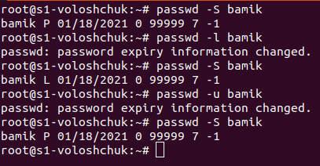

We can also modify the state of a user by locking or unlocking with `usermod`.

To lock the user, you can use the -L option in this manner:

`usermod -L user_name`

To unlock the user, you can use the -U option:

`usermod -U user_name`

10. How to remove a user's password and provide him with a password-free login for subsequent password change?

To delete and change the password by user uses the command:

`passwd -d -e username`

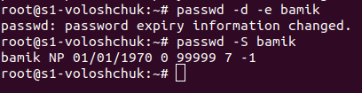

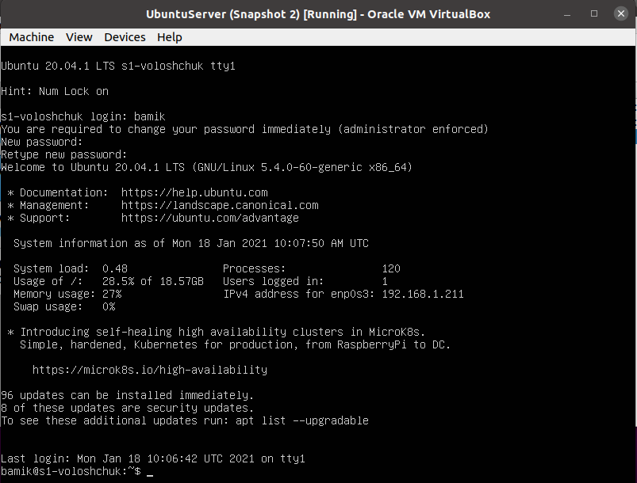

11. Display the extended format of information about the directory, tell about the information columns displayed on the terminal.

`ls -la`

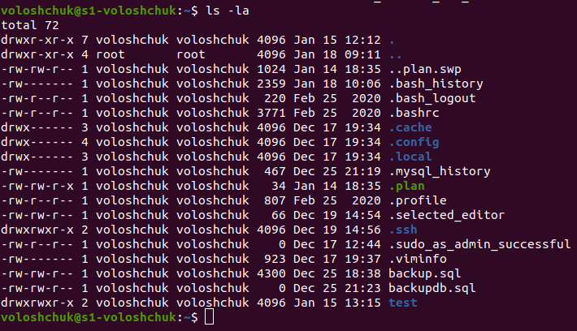

As you can see in the illustration above, the output has 8 columns. And this is information about the contents of each of the columns:

    The first column contains information about the access rights to the directory item
    The second column contains the number of hard links to the directory item
    The third and fourth columns contain the names of the user and user group that owns the directory entry
    The fifth column contains the size of the directory item
    The sixth and seventh columns contain the date and time the directory item was modified
    The last, eighth column contains the name of the directory item

12. What access rights exist and for whom (i. e., describe the main roles)? Briefly describe the acronym for access rights.

For effective security, Linux divides authorization into 2 levels: Ownership and Permission

Every file and directory on Linux system is assigned 3 types of owner: User, Group and Others

Every file and directory in Linux system has following 3 permissions defined for all the 3 owners discussed above: Read, Write and Execute.

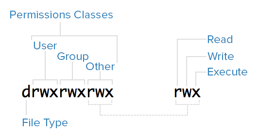

