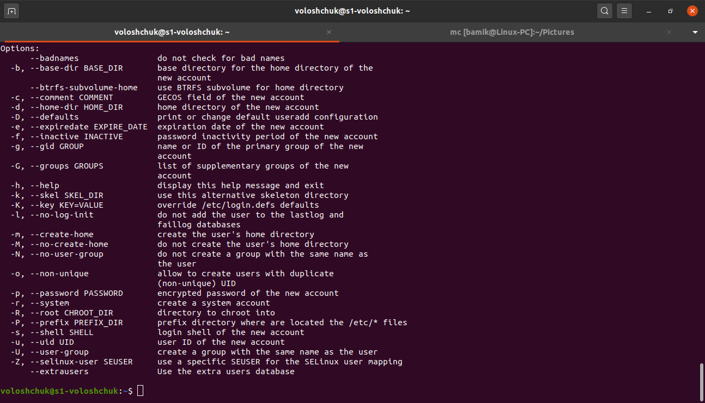
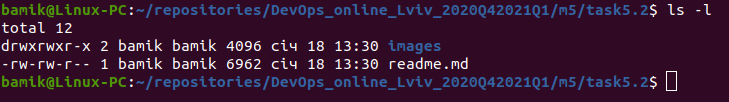
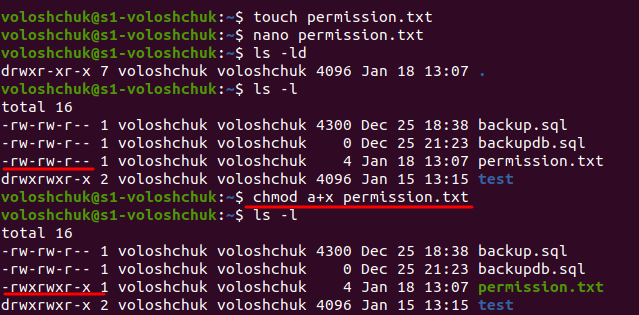

TASK 5.2

1. Analyze the structure of the /etc/passwd and /etc/group file, what fields are present in it, what users exist on the system? Specify several pseudo-users, how to define them.

Linux stores most account features in the /etc/passwd file. It is a text-based file with with seven fields for each entry. Each entry begins with a username and continues with a set of fields separated by colons (:). Here is the syntax of an entry in the /etc/passwd file:

username:password:UID:GID:comment:home directory:default shell

In the picture above we can see the following information:

    username – voloshchuk 
    password – stored in the /etc/shadow file
    UID – 1000
    GID – 1000
    comment – full name of the user is Yaroslav Voloshchuk, phone numbers
    home directory – /home/voloshchuk
    default shell – /bin/bash

The group membership in Linux is controlled through the /etc/group file. This is a simple text file that contains a list of groups and the members belonging to each group. Just like the /etc/passwd file, the /etc/group file consists of a series of colon-delimited lines, each of which defines a single group. The file is readable by all users.

Here is how an entry in the /etc/group file looks like:

group name:password:GID:list of users

In the example above you can see that the group `adm` has a GID of 4 and two users: syslog and voloshchuk.
 
Linux distributions contains pseudo-user description lines in the `passwd` file. These descriptions are never edited. Users of these names are not registered in the system and are only needed to confirm owner ship of the processes.

The most used are: daemon (used by system service processes), bin (gives ownership of executables command), adm (own sregistration files), nobody (used by many services), sshd (used by the secure shell server).

2. What are the uid ranges? What is UID? How to define it?

A UID (user identifier) is a number assigned by Linux to each user on the system. This number is used to identify the user to the system and to determine which system resources the user can access. UIDs are stored in the `/etc/passwd` file:

`cat /etc/passwd`

The third field represents the UID. Notice how the root user has the UID of 0. Most Linux distributions reserve the first 100 UIDs for system use. New users are assigned UIDs starting from 500 or 1000. For example, new users in Ubuntu start from 1000.

When you create a new account, it will usually be give the next-highest unused number. If we create a new user on our Ubuntu system, it will be given the UID of 1001.

3. What is GID? How to define it?

Groups in Linux are defined by GIDs (group IDs). Just like with UIDs, the first 100 GIDs are usually reserved for system use. The GID of 0 corresponds to the root group and the GID of 100 usually represents the users group. GIDs are stored in the `/etc/group` file:

`cat /etc/group`

The third field represents the GID. New groups are usually assigned GIDs starting from 1000.

4. How to determine belonging of user to the specific group?

`id username` or `cat /etc/group | grep username`

5. What are the commands for adding a user to the system? What are the basic parameters required to create a user?

To add/create a new user, all you've to follow the command `useradd` or `adduser` with 'username'. 

`useradd` is a low-level utility for adding users to a system.

When we run `useradd` command in Linux terminal, it performs following major things:

    It edits /etc/passwd, /etc/shadow, /etc/group and /etc/gshadow files for the newly created User account.
    Creates and populate a home directory for the new user.
    Sets permissions and ownerships to home directory.

Basic parameters required to create a user:

6. How do I change the name (account name) of an existing user?

`usermod -l login-name old-name`

7. What is skell_dir? What is its structure?

Skel is derived from the skeleton because it contains basic structure of home directory.

The /etc/skel directory contains files and directories that are automatically copied over to a new user’s when it is created from useradd command.

This will ensure that all the users gets same intial settings and environment.

`ls -la /etc/skel/`

8. How to remove a user from the system (including his mailbox)?

To delete a user via the command line:

`# userdel username`

To remove the user's home directory and mail spool:

`# userdel -r username`

9. What commands and keys should be used to lock and unlock a user account?

Verify the status of a user with `passwd` command

`passwd -S user_name`

Look at the second field in the output. Here’s what it means:

– P or PS: password is set (user is unlocked)
– L or LK: User is locked
– N or NP: No password is needed by the user

To lock a user use the option -l or –lock in this manner:

`passwd -l user_name`

To unlock the  use the option -u or –unlock:

`passwd -u user_name`

We can also modify the state of a user by locking or unlocking with `usermod`.

To lock the user, you can use the -L option in this manner:

`usermod -L user_name`

To unlock the user, you can use the -U option:

`usermod -U user_name`

10. How to remove a user's password and provide him with a password-free login for subsequent password change?

To delete and change the password by user uses the command:

`passwd -d -e username`

11. Display the extended format of information about the directory, tell about the information columns displayed on the terminal.

`ls -la`

As you can see in the illustration above, the output has 8 columns. And this is information about the contents of each of the columns:

    The first column contains information about the access rights to the directory item
    The second column contains the number of hard links to the directory item
    The third and fourth columns contain the names of the user and user group that owns the directory entry
    The fifth column contains the size of the directory item
    The sixth and seventh columns contain the date and time the directory item was modified
    The last, eighth column contains the name of the directory item

12. What access rights exist and for whom (i. e., describe the main roles)? Briefly describe the acronym for access rights.

For effective security, Linux divides authorization into 2 levels: Ownership and Permission

Every file and directory on Linux system is assigned 3 types of owner: User, Group and Others

Every file and directory in Linux system has following 3 permissions defined for all the 3 owners discussed above: Read, Write and Execute.

For example, file readme.md has next permissions:

-rw-rw-r--

Owner - read and write.
Group - read and write.
Others - read only.

13. What is the sequence of defining the relationship between the file and the
user?

For example, take a file in the home directory `permission.txt`

Let's analyze it.

Access rights `-rw-r--r--` what means for Owner - read and write, for Group - read only and for Others - read only too.

Then the number of hard links to file - 1.

Names of the user and user group that owns - voloshchuk

Size of the file: 4

Date and time the file  was modified: Jan 18 13:07 

And last column  contains the name of the file - permission.txt.

Also,  we can view the access rights to the file with the command `stat`

14. What commands are used to change the owner of a file (directory), as well as the mode of access to the file? Give examples, demonstrate on the terminal.

To change the mode of a file, use the `chmod` command. The general form is

     ` chmod X@Y file1 file2 ...`

where: X is any combination of the letters `u' (for owner), `g' (for group), `o' (for others), `a' (for all; that is, for `ugo'); @ is either `+' to add permissions, `-' to remove permissions, or `=' to assign permissions absolutely; and Y is any combination of `r', `w', `x'. Following are some examples:

     chmod u=rx file        (Give the owner rx permissions, not w)
     chmod go-rwx file      (Deny rwx permission for group, others)
     chmod g+w file         (Give write permission to the group)
     chmod a+x file1 file2  (Give execute permission to everybody)
     chmod g+rx,o+x file    (OK to combine like this with a comma)

For example create file `permission.txt` and  give it all permission `chmod a+x permission.txt`

15. What is an example of octal representation of access rights? Describe the umask command.

We can use the octal notation to set permissions. To describe the octal notation, we can add permission values to obtain new, combined (octal) values.

Permission values:

0 = No Permission
1 – able to execute (x)
2 – able to write (w)
4 – able to read (r)

The octal number is the sum of the permission values, for example:

3 (1+2) – able to execute and write
6 (2+4) – able to write and read

Permission numbers are:

    0 = ---
    1 = --x
    2 = -w-
    3 = -wx
    4 = r-
    5 = r-x
    6 = rw-
    7 = rwx

For example:

On Linux all new files are created with a default set of permissions. The `umask` utility allows you to view or to set the file mode creation mask, which determines the permissions bits for newly created files or directories.

It is used by `mkdir, touch, tee` and other commands that create new files and directories.

By default, on Linux systems, the default creation permissions are 666 for files, which gives read and write permission to user, group, and others, and to 777 for directories, which means read, write and execute permission to user, group, and others. Linux does not allow a file to be created with execute permissions.

The default creation permissions can be modified using the umask utility.

umask affects only the current shell environment. On most Linux distributions the default system-wide umask value is set in the pam_umask.so or /etc/profile file.

If you want to specify a different value on per-user basis edit the user’s shell configuration files such as ~/.bashrc or ~/.zshrc. You can also change the current session umask value by running umask followed by the desired value.

For example, to calculate how umask 022 will affect newly created files and directories, use:

    Files: 666 - 022 = 644. 
    Directories: 777 - 022 = 755.

16. Give definitions of sticky bits and mechanism of identifier substitution. Give an example of files and directories with these attributes.

The sticky bit was initially introduced to ‘stick’ an executable program’s text segment in the swap space even after the program has completed execution, to speed up the subsequent runs of the same program. However, these days the sticky bit means something entirely different.

When a directory has the sticky bit set, its files can be deleted or renamed only by the file owner, directory owner and the root user. The command below shows how the sticky bit can be set.

`chmod +t `

Simply look for a ‘t’ character in the file permissions to locate the sticky bit. The snippet below shows how we can set the sticky bit for some directory “test”, and how it prevents the new user from deleting a file in the directory.

To remove the sticky bit, simply use the following command.

`chmod -t`

Since deleting a file is controlled by the write permission of the file, practical uses of the sticky bit involve world-writable directories such as ‘/tmp’ so that the delete permissions are reserved only for the owners of the file. 

17. What file attributes should be present in the command script?

Script command in Linux is used to make typescript or record all the terminal activities.

After executing the script command it starts recording everything printed on the screen including the inputs and outputs until exit. 

`script my.log`

Options:

-a, –append: This option is used when we want to append the output, retaining the prior content of the file. The multiple contents get separated by adding a line that states the date and time of the script started.

-c, –command: This option is used when we want to run a particular command rather than interactive shell and get terminal information in the file given as argument or typescript by default. The script will automatically exit after successful execution. 

-e, –return: This option simply return exit code of the child process.

-f, –flush: This option is used to run flush output after each write. It’s useful for telecooperation

–force: This option allows default output file i.e. typescript to be hard or symbolic link. 

-q, –quiet: This option does not display the notification stating that the script has started and quietly execute and exit the script command. 

-t, –timing[=]: This option allows user to capture the terminal activity step by step and appears like a video when the recorded file is executed with the help of scriptreplay command. 

