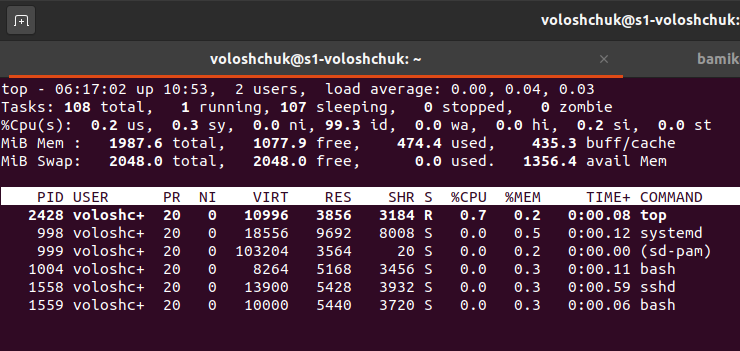
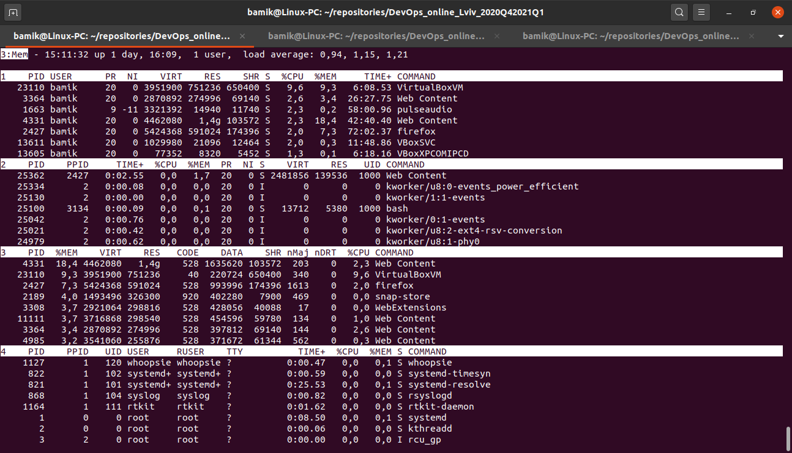
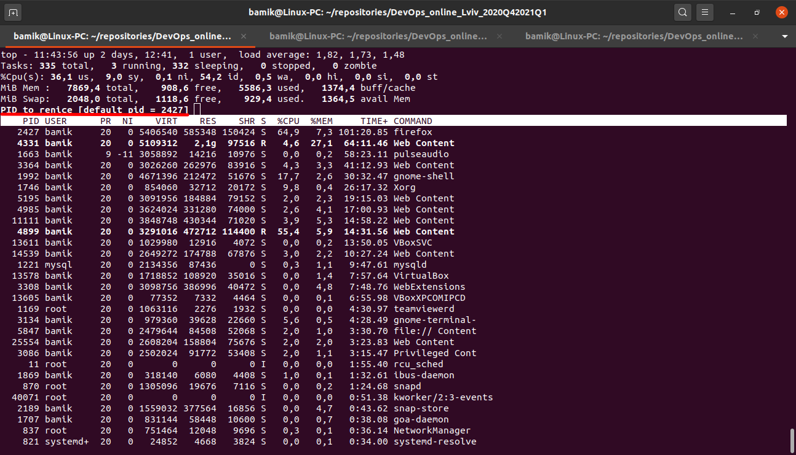

TASK 5.3

1. How many states could has a process in Linux?

The following are the process states:

1) `Running`: This is a state where a process is either in running or ready to run.
2) `Interruptible`: This state is a blocked state of a process which awaits for an event or a signal from another process
3) `Uninterruptible`: It is also a blocked state. The process is forced to halt for certain condition that a hardware status is waited and a signal could not be handled.
4) `Stopped`: Once the process is completed, this state occurs. This process can be restarted
5) `Zombie`: In this state, the process will be terminated and the information will still be available in the process table.

2. Examine the pstree command. Make output (highlight) the chain (ancestors) of the current process.

`Pstree` command in Linux that shows the running processes as a tree which is a more convenient way to display the processes hierarchy and makes the output more visually appealing. The root of the tree is either init or the process with the given PID.

3. What is a proc file system?

Proc file system (procfs) is virtual file system created on fly when system boots and is dissolved at time of system shut down.

It contains the useful information about the processes that are currently running, it is regarded as control and information centre for kernel.

The proc file system also provides communication medium between kernel space and user space.

`ls -l /proc`

4. Print information about the processor (its type, supported technologies, etc.)

`cat /proc/cpuinfo` or `lscpu`

5. Use the `ps` command to get information about the process. The information should be as follows: the owner of the process, the arguments with which the process was launched for execution, the group owner of this process, etc.

`ps -aux` or `ps -axfo user,group,pid,%cpu,%mem,vsz,rss,tty,start,time,command`

6. How to define kernel processes and user processes?

A system process is initiated (or owned) by the operating system. These are critical processes that are required by the system for its functioning.

User process is something that you initiate, eg. any custom application that you would create.

The linux kernel processes are started by the kernel itself, and the kthread process with PID = 2 is assigned to the parent process that allegedly spawned them. Thus, the processes of the kernel should be considered the process itself with PID = 2, as well as processes whose PPID (i.e. the pid of the parent) is 2.

`ps --ppid=2 --pid=2`

User processes - all others:

`ps -N --ppid=2 --pid=2`

Also, by default `pstree` without parameters shows only the tree of processes spawned by init, i.e. user processes. Kernel processes will show  `pstree 2`  

7. Print the list of processes to the terminal. Briefly describe the statuses of the processes. What condition are they in, or can they be arriving in?

Column STAT displayed to describe the state of a process:

       D    uninterruptible sleep (usually IO)
       R    running or runnable (on run queue)
       S    interruptible sleep (waiting for an event to complete)
       T    stopped, either by a job control signal or because it is being traced.
       W    paging (not valid since the 2.6.xx kernel)
       X    dead (should never be seen)
       Z    defunct ("zombie") process, terminated but not reaped by its parent.

       When the stat keyword is used, additional characters may be displayed:

       <    high-priority (not nice to other users)
       N    low-priority (nice to other users)
       L    has pages locked into memory (for real-time and custom IO)
       s    is a session leader
       l    is multi-threaded (using CLONE_THREAD, like NPTL pthreads do)
       +    is in the foreground process group.

8. Display only the processes of a specific user.

`ps -u username`

9. What utilities can be used to analyze existing running tasks (by analyzing the help for the ps command)?

`pgrep, pstree, top, proc`

`pgrep` is a command-line utility that allows you to find the process IDs of a running program based on given criteria. It can be a full or partial process name, a user running the process, or other attributes.

`top` command is used to show the Linux processes. It provides a dynamic real-time view of the running system. Usually, this command shows the summary information of the system and the list of processes or threads which are currently managed by the Linux Kernel.

About `pstree` and `proc`  described above. 

10. What information does `top` command display?

`top` command displays processor activity of your Linux box and also displays tasks managed by kernel in real-time. It'll show processor and memory are being used and other information like running processes. This may help you to take correct action.

11. Display the processes of the specific user using the top command.

`top -u username` 

For example: `top -u voloshchuk`

12. What interactive commands can be used to control the top command? Give a couple of examples.

In running `top` command press: 

`Shift + f` - to enter the interactive menu

`Shift + p` - to sort processes as per CPU utilization

`Shift + m` - to sort by memory usage
    
`Shift + n` - to sort by process ID

`Shift + t` - to sort by the running time

`c` - display absolute path of running process.

`z` - display running process in color which may help you to identified running process easily

For example switching to multi-window mode press `Shift + a`:

 
13. Sort the contents of the processes window using various parameters (for example, the amount of processor time taken up, etc.)

The command line option -o (o standing for "Override-sort-field"):

`top -O %CPU` - sorts by the column %CPU

`top -O %MEM` - sorts by the column %MEM

Also I can use VIRT, RES or SHR too. 

14. Concept of priority, what commands are used to set priority?

In Linux system priorities are 0 to 139 in which 0 to 99 for real-time and 100 to 139 for users. Nice value — Nice values are user-space values that we can use to control the priority of a process. The nice value range is -20 to +19 where -20 is highest, 0 default and +19 is lowest.

Instead of launching the program with the default priority, you can use `nice command` to launch the process with a specific priority.

You can change the scheduling priority of a running process to a value lower or higher than the base scheduling priority by using the `renice command` from the command line.

15. Can I change the priority of a process using the top command? If so, how?

In running top command press `r` (use ‘r‘ option to change the priority of the process also called Renice.)

Enter PID and renice to new value. Profit!
