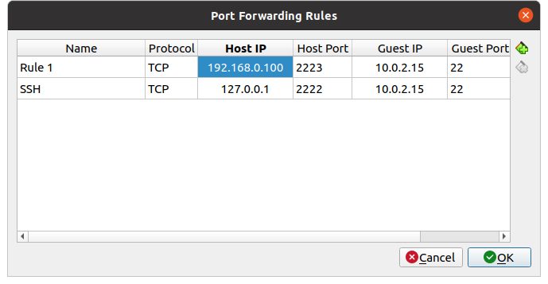

TASK 6.1

1. Network topology:

Host - Ubuntu Desktop 20.04

VM1 - Ubuntu Server 20.04

VM2 - UbuntuServer1 20.04

2. VM1 has 2 interfaces (NAT and internal)

Configure netplan (VM1):

Configure port forwarding on VM1 (interface NAT):

Configure /etc/sysctl.conf:

Then configure netplan on VM2:

 
Сonfigure routing on VM1 (iptables, forward, masquerade):

PROFIT!!! VM2 has an access to the Internet  

Safe iptables: `sudo iptables-save -f /etc/iptables-conf/iptables_rules.ipv4`

Restore iptables: `sudo iptables-restore -vV /etc/iptables-conf/iptables_rules.ipv4` 

3. Check the route from VM2 to Host. 

4.Check the access to the Internet, (just ping, for example, 8.8.8.8):

5. Determine, which  resource has an IP address 8.8.8.8

8.8.8.8 is Google Public DNS

6.Determine, which  IP address belongs to resource epam.com. 

7.Determine the default gateway for your HOST and display routing table.

192.168.0.1 - default gateway on HOST

`route -n` - display routang table

8.Trace the route to google.com:

