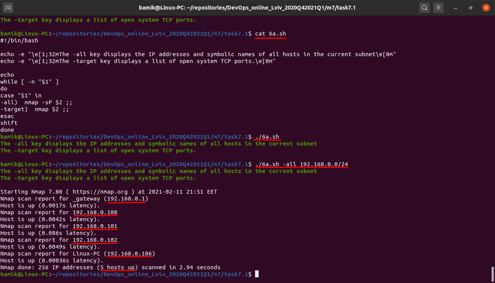
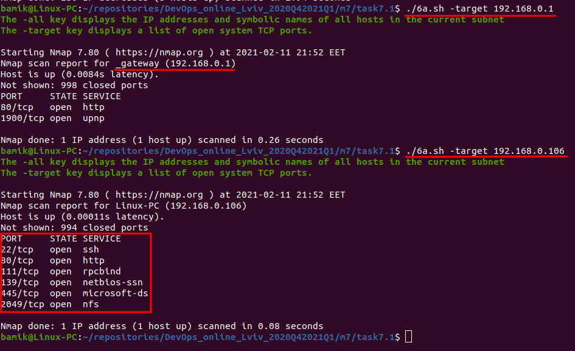

TASK 7.1

 A. Create a script that uses the following keys:

 1. When starting without parameters, it will display a list of possible keys and their description.
 
 2. The --all key displays the IP addresses and symbolic names of all hosts in the current subnet

 3. The --target key displays a list of open system TCP ports.

`#!/bin/bash

echo -e "\e[1;32mThe -all key displays the IP addresses and symbolic names of all hosts in the current subnet\e[0m"
echo -e "\e[1;32mThe -target key displays a list of open system TCP ports.\e[0m"

echo
while [ -n "$1" ]
do
case "$1" in
-all)  nmap -sP $2 ;;
-target)  nmap $2 ;;
esac
shift
done`

