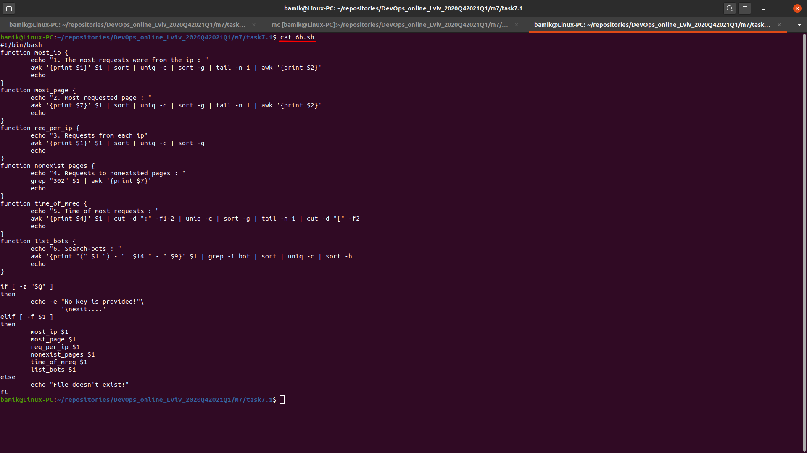
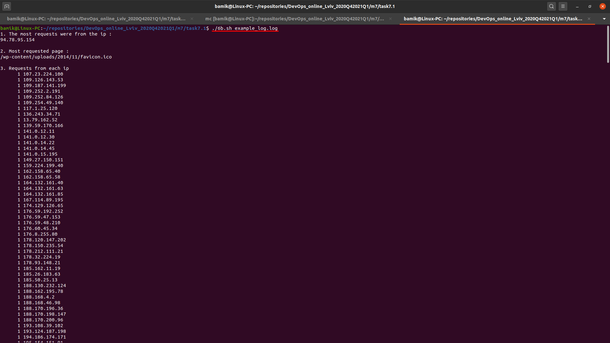
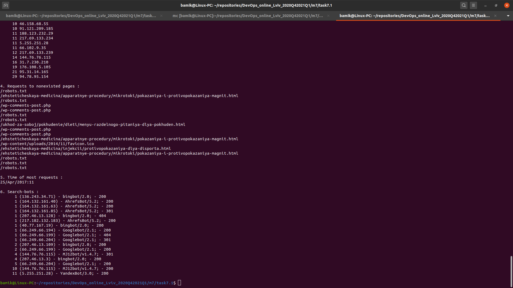

TASK 7.1

 A. Create a script that uses the following keys:

 1. When starting without parameters, it will display a list of possible keys and their description.
 
 2. The --all key displays the IP addresses and symbolic names of all hosts in the current subnet

 3. The --target key displays a list of open system TCP ports.

B. Using Apache log example create a script to answer the following questions:

1. From which ip were the most requests?

2. What is the most requested page?

3. How many requests were there from each ip?

4. What non-existent pages were clients referred to?

5. What time did site get the most requests?

6. What search bots have accessed the site? (UA + IP)

Results:

