Module CI/CD.

 The host with GIT is taken as a basis from where changes on Github are pushed. And two instances AWS, the first with Jenkins, the second with the Apache web server. Automatic deployment is set up. 

 Created new repo on GitHub and cloned to local host:

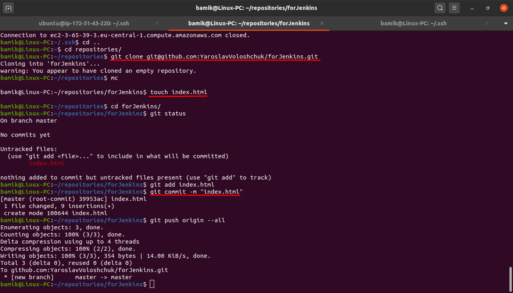

Github project:

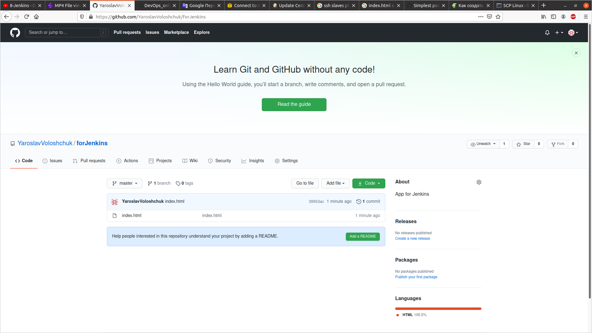

Created new job on Jenkins:

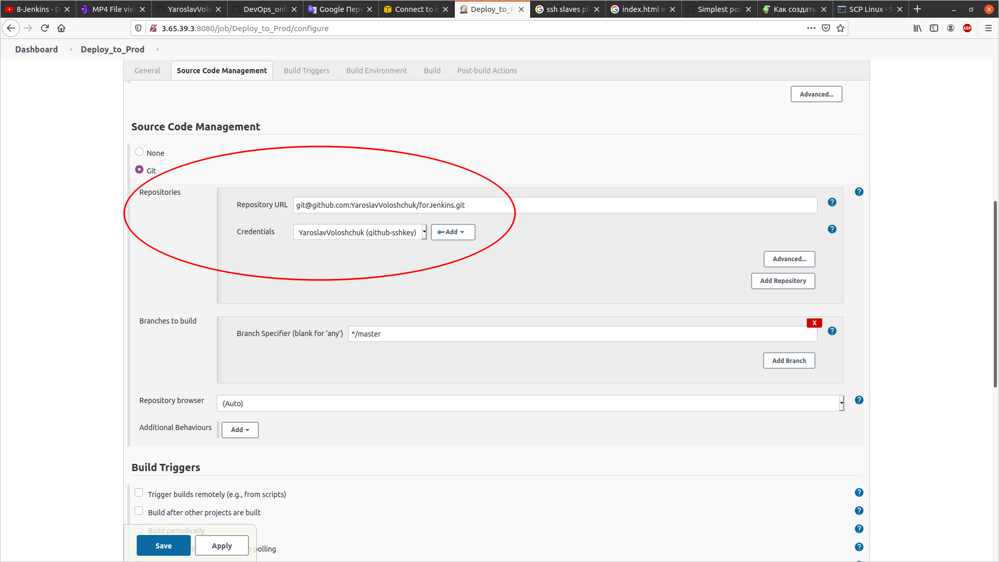

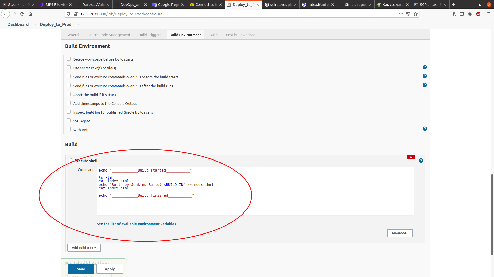

Configured SSH and post-build action:

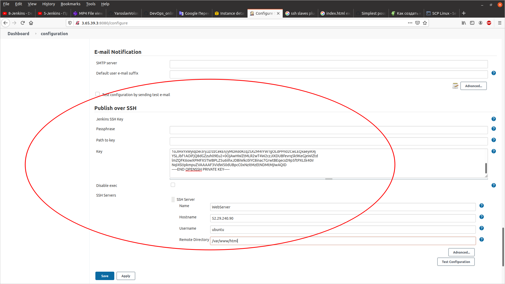

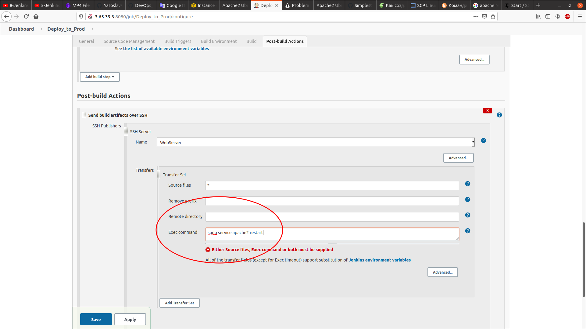

Started job:

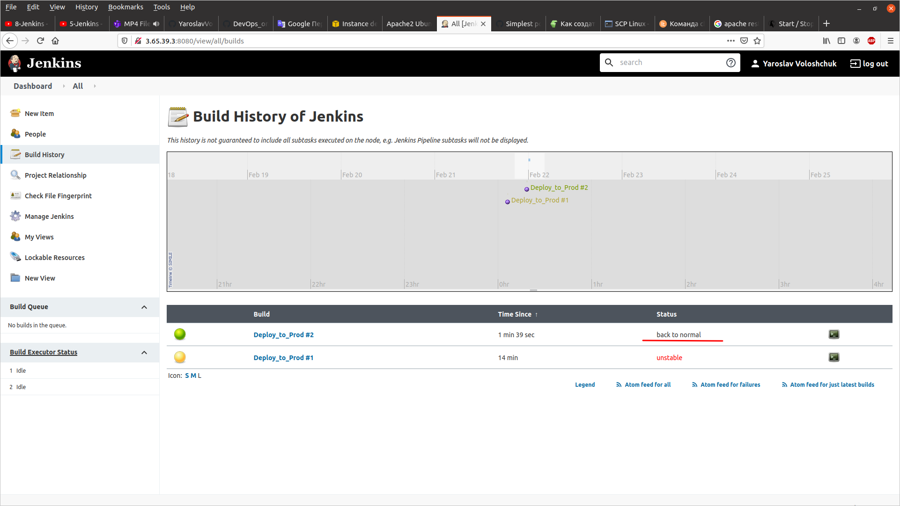

Console output:

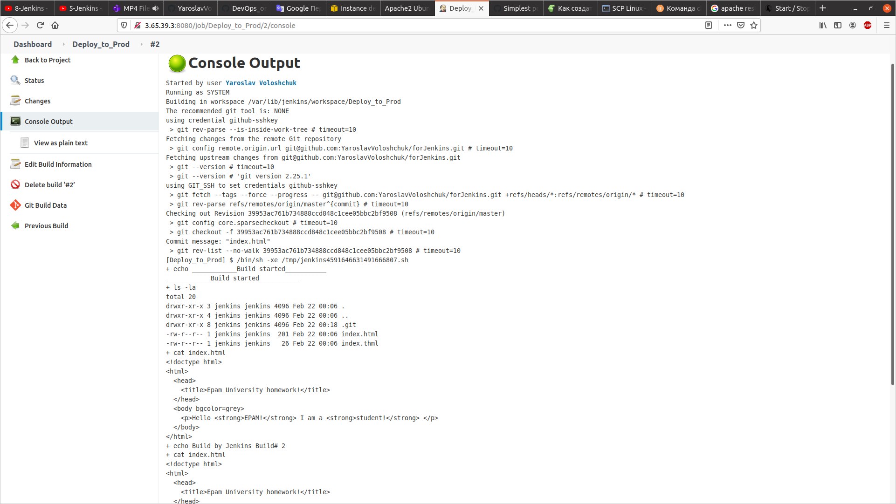

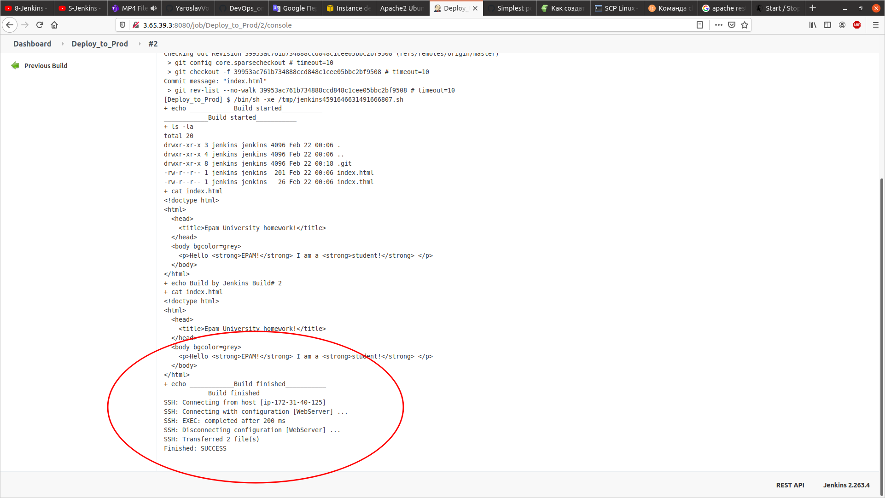

Deployed to WebServer:

AWS:

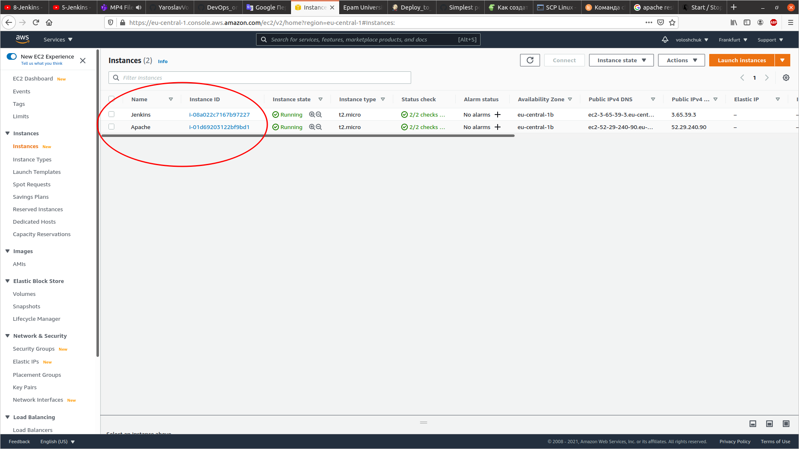

Then congirured autobuild and autodeploy to webserver. Add webhook on GitHub:

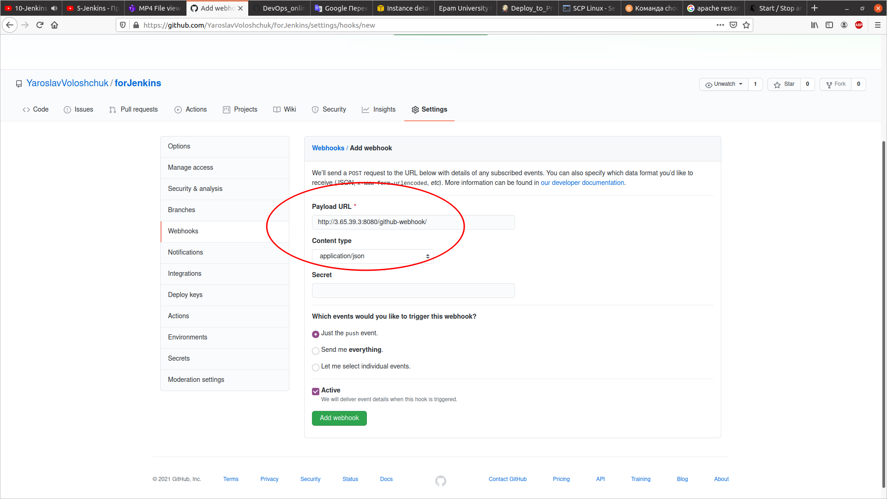

Changed permissions for folder /var/www on WebServer (apache2):

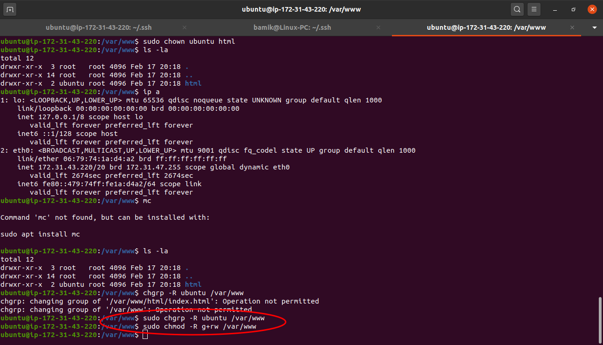

Everything, check if it works. Push new commit to GitHub (changed the file index.html):

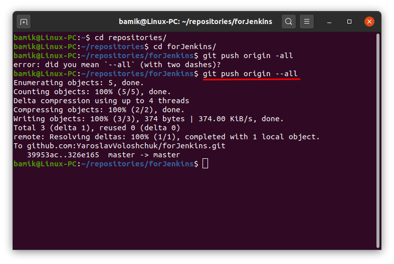

We are browsing the web server:

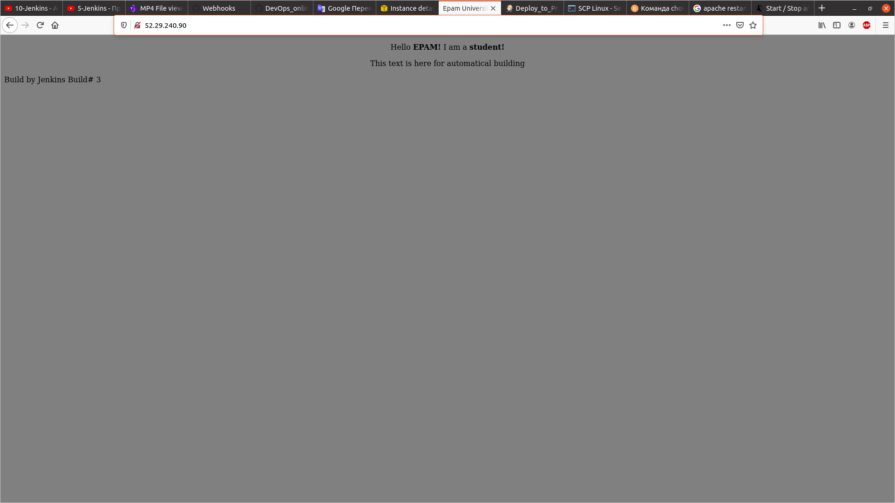

PROFIT! It works!

