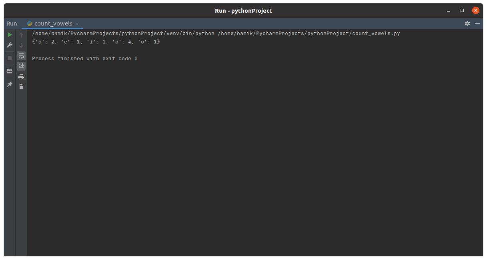

TASK 9.1

1. Develop fizzbuzz function for list of numbers from 1 to 100. (Check in Jupyter) If number divided by 3 without rest, print “Fizz”, If number divided by 5 without rest, print “Buzz”, If number divided by 3 and 5 without rest, print “FizzBuzz”. 

Make unit tests for your new FizzBuzz function:

2. Develop count_vowels function for counting vowels in input text.

